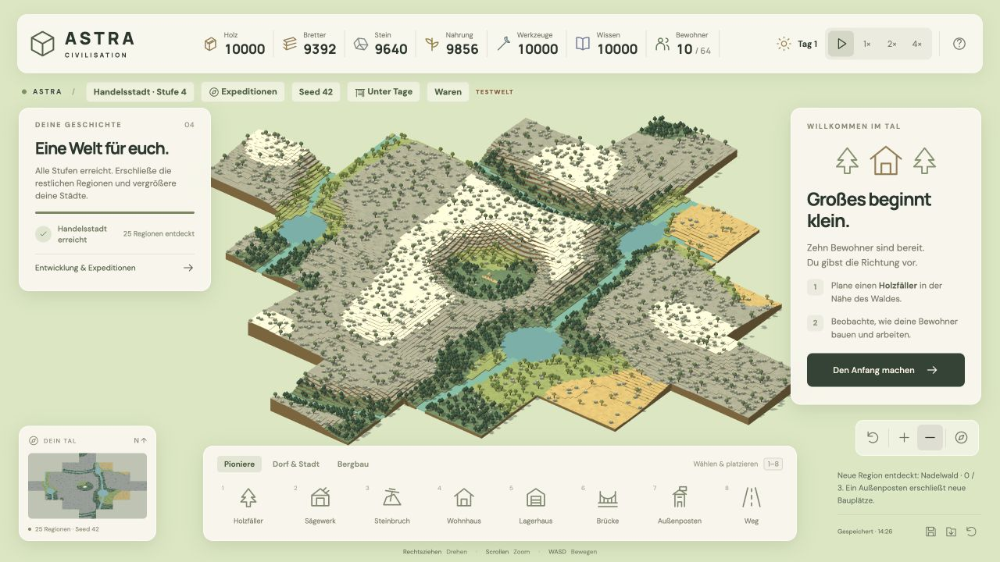
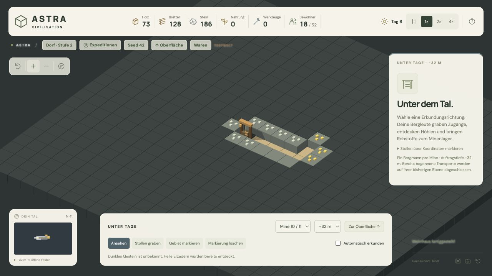

# Astra Civilisation

Voxel-Aufbauspiel mit selbstständig arbeitenden Bewohnern und physischem Warentransport. **Version 0.3 – Lebendige Welten & Untertage** ergänzt Seed-Welten, zusammenhängende Landschaften und Bergbau auf drei Tiefenebenen.

[Öffentliches Repository](https://github.com/sostrowsk/Astra-Civilisation) · [Release Notes](RELEASE_NOTES.md) · [Aktuelle Gesamtspezifikation](docs/GAME-SPEC.md)

## Starten

Node.js 22.18+ oder Node 24/26, npm und ein Desktop-Browser mit WebGL2.

```sh
npm install
npm run dev -- --port 5173
npm test
npm run build
```

Adresse: http://127.0.0.1:5173. GitHub Actions führt bei Push und Pull Request Tests und Build aus.



## Welt und Einstieg

Neue Partien erhalten einen zufälligen Seed. Über **Seed …** oder **Neues Spiel** lässt sich eine Zahl oder ein Text eingeben. Gleicher Seed erzeugt dieselbe Landschaft, andere Seeds neue Höhen, Wälder und Gewässer. Eine kleine Startlichtung und einige Vorkommen sichern den Einstieg.

1. Holzfäller **7 / 10**, Sägewerk **9 / 10** und Steinbruch **9 / 8** bauen.
2. Lagerhaus und Wohnhäuser ergänzen. Alle fünf Pioniergebäudetypen (Holzfäller, Sägewerk, Steinbruch, Wohnhaus, Lagerhaus), 14 Bewohner und die angezeigten Vorräte ermöglichen den Aufstieg zum **Dorf**. Ein Außenposten ist dafür nicht nötig.
3. Über **Expeditionen** eine angrenzende Region erkunden. Die erste Expedition ist bereits im Pionierlager mit ausreichenden Vorräten möglich, ohne Außenposten. Jede Expedition ergänzt 26 × 24 Felder.
4. Nach der ersten Expedition werden **Außenposten** freigeschaltet. Mindestens fünf Felder vom Gründungslager entfernt errichten, beispielsweise **11 / 9**. In neuen Regionen ermöglichen sie normales Bauen in neun Feldern Umkreis.

Die Welt wächst nach Norden, Osten, Süden und Westen ohne feste Anzahl an Regionen. Globale Höhen-, Klima- und Feuchtigkeitsfelder erzeugen Wiesen, Nadelwald, Hochland und Steppe. Mäandernde Flüsse mit verbreiterten Seen und quer verlaufenden Nebenflüssen werden vor den Biomen bestimmt. Gelände und Erzadern werden an einer Erkundungs- oder Biomgrenze nicht neu gestartet.

Brücken entstehen **feldweise** für jeweils vier Bretter und zwei Stein. Vom erreichbaren Ufer oder einer fertigen Brücke aus weiterbauen. Eine Brücke ist kein Pflichtziel mehr, weil nicht jede Startregion einen Fluss enthält.

Um einen Bauplatz freizumachen: **Baum anklicken → Bevorzugt fällen**. Holzfäller bevorzugen markierte Bäume innerhalb ihrer normalen Reichweite von neun Feldern und tragen das Holz regulär ab. Laufende Arbeiten und Lieferungen werden zuerst beendet. Die goldene Markierung bleibt bis zum vollständigen Fällen erhalten; der Auftrag wird mitgespeichert. Im Auswahlfenster lassen sich die Priorität aufheben und Wartegründe ablesen, etwa fehlender Holzfäller, blockierter Weg oder volles Lager.

## Nachwachsende Bäume und Tagebau

Neue Bäume wachsen über **fünf sichtbare Jungbaumstufen**, bevor sie ausgewachsen sind. Solange sie jung sind, bleiben Felder begehbar und bebaubar; Bauen entfernt den Jungbaum. Die Reife dauert je nach Biom 8–15 Spielminuten, mit Försterei halb so lange. Erst ausgewachsene Bäume blockieren das Bauen.

**Steinvorkommen anklicken → Bevorzugt abbauen** gibt diesem endlichen Vorkommen Vorrang. Ein Steinbruch ohne verbleibendes Vorkommen weist auf den Tagebau hin.

**Freies Landfeld anklicken → Tagebau eröffnen** beauftragt Steinbrucharbeiter im Umkreis von neun Feldern. Je Auftrag werden **20 Rohstoffe aus einer Schicht** abgetragen. Die nächste Schicht wird erneut beauftragt; maximal drei Ebenen sind möglich. Vor Ebene 2 müssen die acht Nachbarfelder auf Ebene 1 liegen, vor Ebene 3 auf Ebene 2. Dadurch entstehen Terrassen: mindestens 3×3 Felder für die zweite und 5×5 für die dritte Ebene in der Mitte. Die Tiefe zählt ab der ursprünglichen Oberfläche.

Ebene 1 liefert Stein. Auf Ebene 2 enthalten **5 %**, auf Ebene 3 **10 %** der Feldschichten stattdessen Braunkohle. Die Verteilung hängt vom Seed ab; Braunkohle zählt zum vorhandenen Kohlevorrat. Steinbrüche lagern maximal 20 Stein und 20 Kohle getrennt. Gebäude, Wege und Wasser können nicht abgegraben werden. Begonnene Schichten müssen vor dem Bauen fertig abgegraben werden; der Abbau lässt sich pausieren und fortsetzen.

## Bergbau

Ab dem **Dorf** stehen im Reiter **Bergbau** Mineneingang, Schmelzhütte und Schmiede bereit.

In der Schmelzhütte wählst du unter **Metall schmelzen** Eisen, Kupfer oder Gold. Rezeptänderungen sind auch während der Arbeit möglich: Der laufende Auftrag wird beendet, dann gilt die neue Auswahl. Vorgemerkte Wechsel werden angezeigt und gespeichert. Dasselbe gilt für die Produktwahl in Schmiede, Akademie und Manufaktur.

- Einen fertigen **Mineneingang** auswählen und **Unter Tage ansehen** anklicken. Alternativ oben **Unter Tage** öffnen.
- Zwischen **−12, −32 und −64 Metern** wechseln. Die gewählte Ebene bestimmt den nächsten Auftrag dieser Mine. Laufende Aufträge werden auf ihrer bisherigen Ebene beendet.
- **Stollen graben:** einzelne Felder markieren. **Gebiet markieren:** zwei gegenüberliegende Ecken anklicken, maximal 256 Felder. Eine Koordinateneingabe steht im Inspektor zur Verfügung.
- Markierungen müssen über offene Höhlen oder zusammenhängende Stollen erreichbar werden. Ferne Markierungen allein lassen Arbeiter nicht durch Fels springen.
- **Automatisch erkunden** sucht bekannte Erzadern und gräbt weitere erreichbare Fronten in 18 Feldern Umkreis des Schachts. Abschaltbar, kombinierbar mit eigenen Aufträgen.
- Dunkles Gestein bleibt unbekannt; Höhlen und angrenzende Erzadern werden beim Freilegen sichtbar. Bekannte Höhlen sind begehbar.

Bis zu vier Bergleute pro Mine laufen zum Schacht, graben an unterschiedlichen erreichbaren Fronten und bringen jeweils höchstens zwei Rohstoffe pro Fahrt ins Minenlager. Die Sollbesetzung lässt sich am Mineneingang und unter Tage einstellen (Standard: einer). Normale Träger verteilen sie von dort. Alle Schächte verbinden die drei diskreten Ebenen. Kohle, Kupfer und Eisen treten bereits oben auf; Gold ab −32 m, seltene Diamanten ab −64 m. Vorkommen sind endlich.

| Betrieb / Aktion | Verbrauch | Ergebnis |
|---|---|---|
| Schmelzhütte | 1 Kohle + 1 Eisen-/Kupfer-/Golderz | 1 entsprechender Barren |
| Werkstatt | 1 Stein + 1 Brett | 1 einfaches Werkzeug |
| Schmiede | 1 Eisenbarren + 1 einfaches Werkzeug | 1 Schere oder Bohrer |
| Schafzucht | 1 Nahrung | 2 Wolle |
| Weberei | 1 Wolle | 1 Stoff |
| Schneiderei | 1 Stoff + 1 Scherennutzung | 1 Kleidung |
| Manufaktur | 1 Kupfer / 1 Eisen / 1 Draht + 1 Zahnrad | 2 Draht / 2 Zahnräder / 1 Maschinenteil |
| Akademie | 1 Brett / 1 Kupfer / 1 Gold | 2 / 6 / 20 Wissen |
| Diamanten-Expedition | 2 Diamanten statt sonstiger Vorräte | Eine benachbarte Region; Stufenvoraussetzungen gelten weiter |

Metall und Forschungsrohstoff lassen sich jederzeit im jeweiligen Gebäude auswählen. Ein vorgemerkter Wechsel gilt nach Abschluss des laufenden Auftrags. **Wirtschaft** zeigt alle Rohstoffe, Kapazitäten und Warenflüsse. Schmelzhütte (hoher gemauerter Ofen) und Schmiede (offenes Holzgebäude mit Amboss) haben unterschiedliche Modelle.



## Zivilisation und Bedienung

Über **Bewohnerlabels** kannst du Namen und Tätigkeiten für **Oberfläche** und **Unter Tage** getrennt ein- und ausblenden. Die Einstellung bleibt in diesem Browser für alle Partien gespeichert. Standardmäßig sind beide ausgeschaltet.

Fünf Stufen in fester Reihenfolge: **Pionierlager → Dorf → Viehzucht → Kleinstadt → Manufaktur**. Bevölkerungsgrenzen: **20 / 32 / 48 / 96 / 128**. Wohnhäuser bieten zwei Plätze, Bergmannshäuser vier. Jedes Lagerhaus ergänzt vier eigene Händlerplätze zusätzlich zur normalen Bevölkerungsgrenze.

Schafzucht, Weberei und Schneiderei werden gemeinsam auf Stufe Viehzucht freigeschaltet. Die Kleinstadt und später die Manufaktur benötigen Kleidung. Die Manufaktur verarbeitet Kupfer und Eisen zu Draht, Zahnrädern und Maschinenteilen. Ziele und Aufstiegskosten stehen im Entwicklungsfenster.

Scheren halten 20 Kleidungsstücke; Bohrer beschleunigen 40 Abbauzyklen um 50 %. Ohne Bohrer bleibt Bergbau möglich. Ein Maschinenteil beschleunigt 20 Produktionszyklen in Werkstatt, Bauernhof, Schafzucht oder Weberei um 25 %. Ausrüstung wird automatisch transportiert; Restnutzungen stehen im Gebäudefenster.

### Lager und Personal

Lagerstandorte fassen **100 je Rohstoff**, Produktionsbetriebe meist **10 je Eingang und 20 je Ausgang**, Minen **40 je Fördergut** und **2 Bohrer**. Gemischte Ein-/Ausgänge der Manufaktur fassen 20, Ausrüstungspuffer 2. Wohnhäuser besitzen kein Warenlager. Reservierungen verhindern Überfüllung durch gleichzeitige Lieferungen. Volle Ausgänge stoppen neue Produktion; Träger suchen Lager mit Platz. Baustellenmaterial liegt separat bereit; Rückgaben warten bei vollen Lagern in einer im Dashboard sichtbaren Rückgabemenge.

Jeder Betrieb hat die **Betriebspriorität Niedrig / Normal / Hoch**. Bei gleicher Priorität wird zunächst eine Stelle pro Betrieb besetzt, danach weitere Minenstellen. Höhere Priorität kann Arbeiter übernehmen, sobald sie ihre aktuelle Lieferung oder Arbeit beendet haben. Zwei Träger bleiben frei. Die Statusanzeige unterscheidet Personalmangel, laufende Lieferungen, volle Ausgänge und fehlende Zutaten.

### Heimatorte und Händler

Normale Bewohner arbeiten und tragen Waren innerhalb von **9 Feldern je Richtung** um ihren Heimatort (Gründungslager, Außenposten oder Rathaus). Auch Umwege bleiben in diesem Bereich. Wohnhäuser gehören zum nächstgelegenen Ort; entfernte Betriebe benötigen lokale Wohnhäuser. Waren dürfen nur Händler zwischen verschiedenen Orten transportieren, auch wenn sich deren Bereiche überschneiden.

Jedes fertige **Lagerhaus beherbergt genau vier Händler**. Gründungslager, Außenposten und Rathäuser erhalten keine eigenen Händler. Händler übernehmen keine Produktionsstellen. Sie versorgen zuerst Baustellen, danach Zutaten und Ausrüstung der Betriebe und gleichen anschließend Lagerbestände zwischen Orten aus. Für eine neue entfernte Siedlung zuerst ein Lagerhaus im bestehenden Ort bauen; dessen Händler können den entfernten Außenposten und neue Wohnhäuser versorgen.

| Stufe | Fuhrpark je Lagerhaus | Ladung je Händler |
|---|---|---|
| Pionierlager / Dorf | Zu Fuß | 2 Waren |
| Viehzucht | Höchstens 1 Pferdekarren | 8 Waren im Karren, sonst 2 |
| Kleinstadt / Manufaktur | Höchstens 1 Pferdekarren und 1 Kutsche | 8 im Karren, 16 in der Kutsche, sonst 2 |

Fahrzeuge werden beim Stufenaufstieg automatisch verfügbar. Sie werden am Heimatlager übernommen und bleiben bis zur Rückkehr belegt. Karren und Kutsche können gleichzeitig unterwegs sein; die übrigen Händler laufen. Lagerfenster zeigen alle vier Händler, ihre Ladungen und die Fahrzeugbelegung. Die Wirtschaftsübersicht trennt Händler von örtlichen Trägern.

Beim Lagerabriss bleiben Händler und Waren erhalten. Händler ohne Lager warten auf einen neuen Lagerstandort und werden beim Neubau wieder eingesetzt. Bestehende Spielstände werden beim Laden einmalig um Heimatorte und Händler ergänzt; mitgeführte Waren bleiben erhalten, lokale Aufträge werden neu geplant.

### Wirtschaftsdashboard

**Wirtschaft** öffnet eine laufend aktualisierte Übersicht: Bestand/Kapazität, Waren unterwegs, freier Platz, Gewinnung/Produktion, Verbrauch und Saldo pro Spielminute. Grundlage sind zehnsekündige Messintervalle über die letzten fünf Spielminuten. Transporte werden nicht als Produktion oder Verbrauch gezählt. Baumaterial zählt bei Fertigstellung, Produktionszutaten beim Arbeitsbeginn; Forschungs- und Expeditionskosten bei Zahlung.

Betriebsbedarf, Kosten des nächsten Aufstiegs und optionale Ausrüstung sind separat aufgeführt. Ohne Produktion **und** Verbrauch steht in der Einordnung **„-“**; „Ausgeglichen“ gilt nur bei ausgeglichenen tatsächlichen Warenflüssen. Ein Betriebsverzeichnis zeigt Wartegründe und Personalzahlen. Messwerte beginnen mit diesem Update; alte Produktion wird nicht geschätzt.


Bewohner liefern Baustoffe und Waren selbstständig; mindestens zwei Personen bleiben Träger. Unfertige Bauwerke können abgebrochen werden, geliefertem Material geht nichts verloren. Bäume wachsen langsam bei geringer Walddichte nach; Förstereien beschleunigen dies. Wege und Gebäude bleiben frei. Nahrung wird für Bau, Entwicklung und Schafzucht genutzt, nicht laufend durch Hunger verbraucht.

| Aktion | Steuerung |
|---|---|
| Wählen, bauen, markieren | Linksklick |
| Kamera drehen | Rechtsziehen, Q / E |
| Kamera bewegen | Linksziehen, WASD, Pfeiltasten, Shift + Rechtsziehen |
| Zoom | Mausrad, + / − |
| Heimatansicht | H, Kompass |
| Bauauswahl | 1–8 im aktuellen Reiter |
| Pause / Tempo | Leertaste oder 1× / 2× / 4× |
| Bauplan schließen | Escape |

Holzfäller und Steinbrucharbeiter sind beim Abbau animiert: Axt- beziehungsweise Spitzhackenschläge mit passenden Splittern zeigen die Arbeit am Vorkommen und im Tagebau. Die Bewegungen folgen Spieltempo und Pause.

## Gebäude abreißen

**Gebäude anklicken → Gebäude abreißen → Jetzt abreißen** entfernt jedes fertige Gebäude – einschließlich Gründungslager, Minen und Brücken – und gibt das Feld für Neubauten frei. „Behalten“ bricht den Vorgang ab. Bewohner bleiben in der Siedlung, zugewiesene Arbeiter werden frei; weniger Wohnraum verhindert weiteren Zuzug, bis wieder Platz vorhanden ist.

Lagerwaren und bereits transportierte Güter bleiben erhalten. Bei vollen Lagern warten sie als Rückgaben im Wirtschafts-Dashboard. Baukosten, bereits verbrauchte Produktionszutaten und angebrochene Ausrüstung werden nicht erstattet. Das Gründungslager kann unter **Dorf & Stadt → Gründungslager** kostenlos neu errichtet werden; es gibt höchstens eines gleichzeitig. Auch ganz ohne Gebäude bleibt die Partie spielbar und speicherbar. Beim Minenabriss werden Bergleute samt Ladung an die Oberfläche geholt; Höhlen bleiben erhalten. Beim Brückenabriss werden Bewohner auf ein sicheres Feld versetzt und laufende Wege neu geplant; abgeschnittene Transporte werden mit Warenrückgabe aufgehoben. Getrennte Ufer benötigen für den Warenaustausch wieder eine Brücke. Der Abriss eines Außenpostens entfernt dessen Baubereich, aber keine bereits entdeckten Regionen.

## Spielstände

Über **Spielstände** verwaltest du mehrere benannte Partien: laden, umbenennen und nach Bestätigung löschen. **Neue Welt** startet eine zufällige Welt oder einen eingegebenen Seed. **Neu starten** beginnt dieselbe Landschaft als zusätzliche Partie im Pionierlager; der bisherige Fortschritt bleibt erhalten. Vor jedem Wechsel wird die aktuelle Partie gespeichert. Beim Öffnen wird die zuletzt gewählte Welt fortgesetzt.

Lokale Speicherung alle 20 Sekunden, beim Verlassen und über den Speicherknopf. Die lokale IndexedDB-Datenbank `astra-civilisation` enthält je Partie eigene Daten und Metadaten; Sandbox-Partien sind getrennt. Ein vorhandener Spielstand unter **`astra-civilisation:save:v3`** in IndexedDB oder localStorage wird einmalig als „Mein bisheriges Tal“ übernommen, ohne die Originaldaten zu entfernen. Alle entdeckten Landschaften, Schächte, Markierungen, Waren und laufenden Transporte werden gespeichert. Alte Testpartien von Version 1 und 2 sind deaktiviert und werden nicht migriert oder eingelesen.

Beim Wirtschaftsupdate werden alte Vorräte einmalig auf die neuen Grenzen gekürzt (vom Nutzer ausdrücklich gewünscht). Alte Kleinstadt- und Handelsstadt-Partien werden zur neuen Kleinstadt, ohne Gebäude oder Bewohner zu verlieren. Laufende alte Lieferungen werden neu eingeplant; bereits getragene Güter bleiben als Rückgaben erhalten. Die Wirtschaftsrevision ist separat vom v3-Weltformat gespeichert.

Die Datenbank **IndexedDB** liegt ausschließlich im Browser; kein Server und kein Cloud-Sync. Browserprofil, Hostname und Port bestimmen den Speicherbereich. Beschädigte aktuelle Spielstände werden vor automatischem Überschreiben geschützt. Neue Spiele überschreiben keine andere Partie. Bei einem Speicherfehler wird ein geplanter Wechsel abgebrochen. Das aktive Spiel lässt sich nicht löschen; wechsle dafür zuerst in eine andere Welt.

## Entwicklung und Prüfung

- `src/generator.ts`: globaler Seed-Generator und Regionenkoordinaten.
- `src/sim.ts`: Wirtschaft, Wegsuche, Expeditionen, Wachstum und Fortschritt.
- `src/mining.ts`: Höhlen, Erzadern, Aufträge, Erkundung und Transporte.
- `src/world.ts`: Three.js, instanziertes Gelände, Tiefenansicht und Voxelmodelle.
- `src/main.ts`: Oberfläche und Eingaben; `src/persistence.ts`: IndexedDB-Zugriff; `src/save-library.ts`: getrennte Spielstände und Übernahme bisheriger Partien.
- `src/*.test.ts`: Verhaltenstests für Generator, Wirtschaft, Bergbau und Speicherstände.

`npm run fixtures` erzeugt isolierte Testwelten: `?sandbox=1&scenario=village` und `mining` stammen aus einem echten Produktionsdurchlauf. `?sandbox=1&scenario=world` ist eine ausdrücklich mit Vorräten ausgestattete Landschaftsvorschau mit 25 Regionen. `?sandbox=1&scenario=economy` ist eine ausdrücklich finanzierte Vorschau mit tatsächlich errichteten und produzierenden Textil- und Metallbetrieben. Die Fixtures sind nur im Entwicklungsserver verfügbar, werden nicht im Produktionsbuild ausgeliefert und schreiben ausschließlich in einen separaten Testspielstand.

Der automatisierte Start-bis-Eisenscheren-Durchlauf benötigt mit Seed 42 etwa **36,4 Simulationsminuten**. Das ist eine Spielbarkeitsprüfung und keine gemessene menschliche Spielzeit. Weitere Prüfungen: [QA-Protokoll](docs/QA.md). Die [Gesamtspezifikation vom 22. September 2026](docs/GAME-SPEC.md) beschreibt alle aktuellen Spielregeln, Balancingwerte, technischen Grenzen und Abnahmeszenarien. Frühere Spezifikationen und Umsetzungspläne bleiben als historische Dokumente erhalten.

## Grenzen

Die 3D-Ansicht zeigt einen kreisförmigen Bereich von **bis zu 30 Feldern Radius um das aktuelle Fokusfeld der Kamera**, an der Oberfläche und unter Tage. Der Fokus bleibt so weit innerhalb der erkundeten Welt, dass der ganze Kreis hineinpasst, auch bei fehlenden Regionen und Ecken. In kleineren Welten wird der größte vollständig passende Kreis verwendet; Expeditionen aktualisieren die Grenzen automatisch. Dadurch lässt sich der Fokus nicht unmittelbar an Kartenränder oder in schmale Ausläufer bewegen. Zusätzlich zum voll sichtbaren Kern gehen drei weitere Felder Radius mit einem weichen Nebelübergang in die Hintergrundfarbe über (normalerweise 30 + 3 = 33 Felder). Der Rand bleibt blickdicht, damit keine innenliegenden Blockflächen durchscheinen. Dieser Saum darf über die Kartengrenze hinausreichen und skaliert beim Zoomen mit dem Gelände. Vorhandene Felder im Saum können ausgewählt und bebaut werden. Beim Verschieben werden Gelände, Gebäude und Bewohner nachgeführt; die Übersichtskarte zeigt weiterhin die gesamte erkundete Welt. Außerhalb des Sichtbereichs laufen Produktion und Transporte weiter. Erkundete Regionen werden weiterhin gemeinsam im Speicher gehalten und lokal gespeichert. Sehr große Welten können Browser-Speicherquota, RAM und Simulationsleistung erreichen; es gibt noch kein Auslagern ferner Regionen. Untertage umfasst drei taktische Tiefenebenen, keine First-Person-Steuerung und kein frei verformbares 3D-Blockvolumen. Gewässer werden zusammenhängend erzeugt, aber nicht als Flüssigkeit zur Laufzeit simuliert. Keine Monster, Einstürze, Multiplayer oder vollständige Touch-Steuerung.

Geometrie, Icons und Schriftdateien werden lokal ausgeliefert. Three.js und Vite mit TypeScript; DM Sans und Manrope über Fontsource. Keine externen Assets während des Spiels. Schriftlizenzen liegen in den jeweiligen npm-Paketen.

### Bergmann-Siedlung aufbauen

Ab Stufe Dorf im Reiter **Bergbau → Bergmannshaus** bauen (6 Holz, 10 Bretter, 8 Stein). Bis zu vier neue Bewohner ziehen am Haus ein, sofern die Bevölkerungsgrenze Platz bietet. Sie bevorzugen freie Stellen in erreichbaren Minen innerhalb von zwölf Feldern; ansonsten helfen sie bei anderen Betrieben und Transporten. Bestehende Belegschaften werden nicht verdrängt.

An der Mine **Bergleute einstellen → 4 Bergleute** wählen. Der Zähler zeigt Ist- und Sollbesetzung. Mindestens zwei allgemeine Träger bleiben frei. Mehrere erreichbare Fronten sind nötig, damit mehrere Arbeiter gleichzeitig graben können. Ein Lagerhaus nahe dem Schacht verkürzt den Abtransport. Beim Reduzieren oder Pausieren liefert die Mannschaft laufende Ladungen noch ab.

Bestehende v3-Partien bleiben kompatibel, bestehende Minen behalten zunächst einen Arbeitsplatz. Bohrer bieten jetzt einen begrenzten Förderbonus; die Werkstatt stellt einfache Werkzeuge her und die Schmiede die Spezialausrüstung. [Umsetzungsplan](docs/MINING-SETTLEMENT-PLAN.md).

### Bergleute finden

Unter Tage zeigt der Kasten **Bergbau-Betrieb**, wie viele Bergleute der Mine zugeteilt sind, wo die einzelnen Personen gerade arbeiten und warum sie gegebenenfalls wartet. Mit **Bergmann auswählen** lässt sich jedes Mannschaftsmitglied auswählen. **Bergmann zeigen** führt die Kamera zum tatsächlichen Aufenthaltsort. Helm, Spitzhacke und Namensmarkierung kennzeichnen die Figuren. Bei vollem Minenlager holen Träger die Waren ab; die Abholung wechselt fair zwischen Betrieben und Rohstoffen.
