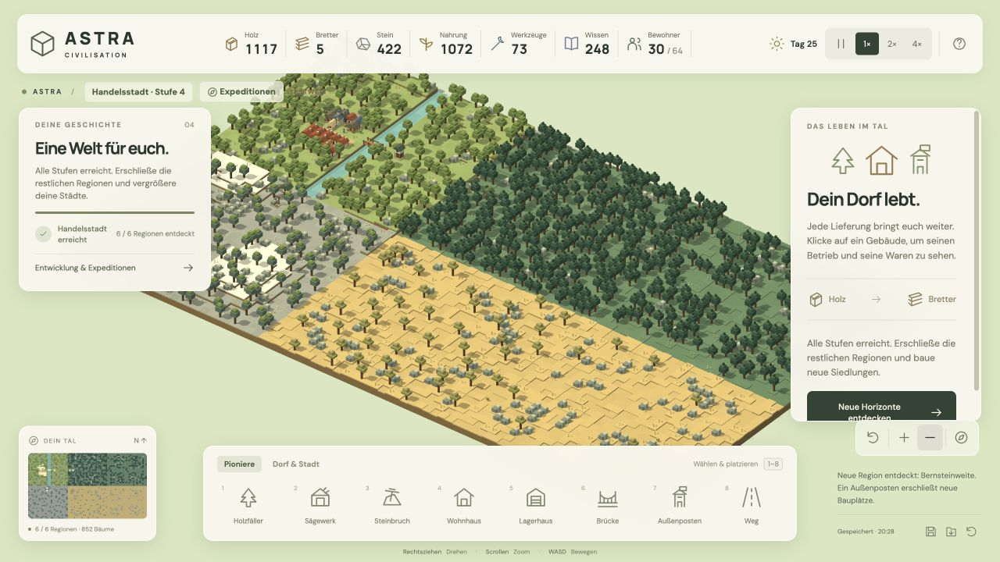

# Astra Civilisation

Ein spielbarer Voxel-Aufbauprototyp mit autonomer Warenwirtschaft. **Version 0.2 – Neue Horizonte** führt vom Pionierlager über Dorf und Kleinstadt bis zur Handelsstadt: sechs erschließbare Regionen, vier Biome, nachwachsende Wälder und bis zu 64 Bewohner.

Öffentliches Repository: [sostrowsk/Astra-Civilisation](https://github.com/sostrowsk/Astra-Civilisation). Der ursprüngliche MVP ist als Commit `4c1dfb2` erhalten.



## Starten

Voraussetzung: Node.js 22.18+ oder aktuelles Node 24/26, npm und ein Desktop-Browser mit WebGL2/Hardwarebeschleunigung. Entwickelt und getestet mit Node 26.3.0.

```sh
npm install
npm run dev
```

Die im Terminal angezeigte lokale Adresse öffnen, üblicherweise http://127.0.0.1:5173.

```sh
npm test          # Verhaltenstests der Simulation, einschließlich kompletter Mission
npm run build    # TypeScript-Prüfung und Produktionsbuild nach dist/
npm run preview  # Produktionsbuild lokal ansehen
```

## Erste Partie

1. Unten einen **Holzfäller** wählen und auf ein freies Feld beim Wald klicken.
2. Ein **Sägewerk** und einen **Steinbruch** nahe der nördlichen Steine ergänzen.
3. Eine **Brücke** auf dem Fluss planen. Sie benötigt 12 Bretter und 6 Stein.
4. Nach deren Fertigstellung einen **Außenposten** am Ostufer bauen.

Die Bewohner liefern Baumaterial selbstständig an. Gebäude wachsen nach vollständiger Anlieferung stufenweise. Du darfst Baustellen schon vor ausreichenden Vorräten planen. Noch nicht fertige Baustellen sind abbrechbar; das Material wird zurückgeführt.

Für einen schnellen Einstieg funktionieren diese Felder gut: Holzfäller **7 / 10**, Sägewerk **9 / 10**, Steinbruch **9 / 8**, Brücke **13 / 12**, Außenposten **17 / 12**. Die Koordinatenwahl im Bauplan ist auch per Tastatur bedienbar.

## Steuerung

| Aktion | Steuerung |
|---|---|
| Gebäude wählen / bauen | Linksklick |
| Kamera drehen | Rechte Maustaste ziehen oder Q / E |
| Kamera bewegen | WASD, Pfeiltasten oder Shift + rechts ziehen |
| Zoomen | Mausrad oder +/− in der Oberfläche |
| Heimatansicht | H oder Kompass |
| Bauauswahl | 1–8 |
| Bauplan schließen | Escape |
| Pause / weiter | Leertaste bei fokussierter Welt, oder Pause-Schaltfläche |
| Spieltempo | 1× / 2× / 4× |

Gebäude und Vorkommen lassen sich anklicken. Produzierende Gebäude zeigen ihren Arbeiter, Vorräte und Betriebszustand; ihre Produktion ist pausierbar. Pro Betrieb arbeitet ein Bewohner, mindestens zwei bleiben für Transporte frei. Wege sind kostenlos und beschleunigen das Laufen um 60 %. Wohnhäuser bringen je zwei zusätzliche Menschen bis zur aktuellen Zivilisationsgrenze von 20, 32, 48 oder 64.

## Nach dem ersten Außenposten

Oben auf **Expeditionen** oder den Namen der Zivilisationsstufe klicken. Dort stehen alle Freischaltungen, Ziele und Kosten. Die Welt wächst durch bezahlte Expeditionen; in neuen Regionen ermöglichen Außenposten das Bauen im Umkreis von neun Feldern.

- **Dorf:** Alle sieben Pioniergebäudetypen und 14 Bewohner. Schaltet Bauernhöfe, Försterei und Hochland frei.
- **Kleinstadt:** Landwirtschaft, Aufforstung, neue Außenposten und 22 Bewohner. Schaltet Werkstatt, Akademie, Rathaus und weitere Biome frei.
- **Handelsstadt:** Stadtgebäude, Außenposten in drei Regionen, Werkzeuge, Wissen und 30 Bewohner. Bis zu 64 Bewohner und alle sechs Regionen.

Neue Gebäude stehen im Reiter **Dorf & Stadt**. Bauernhöfe erzeugen Nahrung; Werkstätten machen aus Stein Werkzeuge, Akademien aus Brettern Wissen. Nahrung ist Bau- und Expeditionsmaterial, kein laufender Hungerbedarf. Aktive Förstereien unterstützen die langsame natürliche Wiederbewaldung. Straßen und Gebäude werden nicht überwuchert; kostenlose Wege können künftige Bauplätze freihalten.

Vier Biome unterscheiden sich spielerisch: Wiesen eignen sich für Landwirtschaft, Nadelwälder liefern mehr Holz, Hochland enthält reiche Steinvorkommen, die trockene Steppe wächst und produziert langsamer. Details einschließlich exakter Kosten stehen in der [Erweiterungsspezifikation](docs/EXPANSION-SPEC.md).

## Speichern

Automatisch alle 20 Sekunden und beim Verlassen; zusätzlich über die Speichern-Schaltfläche. Beim Öffnen wird der vorhandene Spielstand fortgesetzt. Manuelles Laden und ein neues Spiel verlangen eine Bestätigung in der Spieloberfläche. Hilfe- und Bestätigungsdialoge pausieren die Simulation.

Gespeichert wird ausschließlich im lokalen Browserspeicher unter `astra-civilisation:save:v2`, einschließlich laufender Aufgaben und Waren unterwegs. Browser/Profil und Ursprung (Hostname + Port) bestimmen den Speicherbereich. Kein Cloud-Sync; das Löschen der Websitedaten löscht auch den Spielstand. Fehler beim Speichern werden angezeigt. Für die normale Partie denselben lokalen Port verwenden.

Alte MVP-Partien werden automatisch übernommen, einschließlich laufender Transporte. Der ursprüngliche Schlüssel `astra-civilisation:save:v1` bleibt unverändert als Sicherung bestehen. Beschädigte vorhandene Daten sperren automatisches Überschreiben; ein bestätigtes neues Spiel hebt den Schutz auf.

## Aufbau

- `src/sim.ts`: deterministische Karte, Wegsuche, Wirtschaft, Aufgaben, Bauvalidierung, Mission und validierter Spielstand.
- `src/world.ts`: Three.js-Szene, Instanzgelände, Voxelmodelle, Kamera, Bauvorschau und Bewohneranimation.
- `src/main.ts`: Spieloberfläche, Eingaben, feste Simulationsschritte und lokales Speichern.
- `src/style.css`: Oberflächengestaltung und Anpassung an kleinere Fenster.
- `src/persistence.ts`: sichere Spielstandübernahme und getrennte Test-Speicherbereiche.
- `src/*.test.ts`: 27 Verhaltenstests ohne Browser oder WebGL.
- `scripts/campaign.ts`: reproduzierbarer Durchlauf aller vier Stufen ohne zusätzliche Rohstoffe.
- [Erweiterungsplan](docs/EXPANSION-PLAN.md), [Erweiterungsspezifikation](docs/EXPANSION-SPEC.md), [Prüfprotokoll](docs/QA.md).
- Historischer MVP: [Spezifikation](docs/MVP-SPEC.md) und [Umsetzungsplan](docs/IMPLEMENTATION-PLAN.md).

Technik: [Three.js](https://threejs.org/docs/) und [Vite](https://vite.dev/guide/) mit TypeScript. Geometrien und Icons sind im Projekt erzeugt. DM Sans und Manrope werden mit ihren Fontsource-Paketen lokal gebündelt; keine externen Fonts oder anderen Netzwerkanfragen während des Spiels. Lizenztexte der Schriftarten liegen in den jeweiligen npm-Paketen.

## Prüfung und isolierte Testpartien

`npm test` prüft die gesamte Kampagne mit regulärer Produktion bis zu sechs Regionen. Der Referenzlauf benötigt ca. 48,6 Simulationsminuten; tatsächliche Spielzeit hängt von Planung, zusätzlichen Betrieben und Zeitraffer ab. GitHub Actions führt Tests und Produktionsbuild bei jedem Push aus.

`?sandbox=1` verwendet einen separaten Testspielstand. Für visuelle Entwicklung lassen sich mit `npm run fixtures` regulär erspielte Zustände erzeugen. Im Entwicklungsserver sind dann `?sandbox=1&scenario=village`, `city`, `frontier` oder `world` verfügbar. Diese Zustände laden nur im Entwicklungsmodus, werden nicht im Produktionsbuild ausgeliefert und greifen nie auf die normale Partie zu.

## Grenzen

Die Welt umfasst sechs Regionen und vier Zivilisationsstufen. Sie ist nicht unendlich. Stein bleibt endlich, Wald erneuert sich. Fertige Gebäude können noch nicht abgerissen werden. Terraforming, freies Blockbauen, Kampf, Multiplayer und vollständige Touch-Steuerung bleiben außerhalb des Umfangs. Es gibt keine Waren-Nachfrage durch Handel oder laufenden Nahrungsverbrauch.

Desktop-Browser mit WebGL2 sind die Zielplattform. Vegetation und Dekoration werden als Instanzen gebündelt, um die größere Welt mit wenigen Zeichenaufrufen darzustellen. Breite GPU-/Browser-Benchmarks stehen noch aus. Das JavaScript-Bundle inklusive Three.js beträgt etwa 163 kB gzip; Vite weist auf seine unkomprimierte Größe hin.
