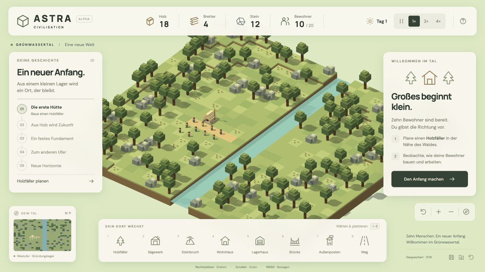

# Astra Civilisation

Ein spielbarer Aufbau-MVP: Warenwirtschaft, zehn autonome Bewohner und eine eigenständig gestaltete 3D-Voxelwelt. Vom Gründungslager über Holzfäller, Sägewerk und Steinbruch zur Brücke und zum ersten Außenposten am Ostufer.



## Starten

Voraussetzung: Node.js 22.18+ oder aktuelles Node 24/26, npm und ein Desktop-Browser mit WebGL2/Hardwarebeschleunigung. Entwickelt und getestet mit Node 26.3.0.

```sh
npm install
npm run dev
```

Die im Terminal angezeigte lokale Adresse öffnen, üblicherweise http://127.0.0.1:5173.

```sh
npm test          # Verhaltenstests der Simulation, einschließlich kompletter Mission
npm run build    # TypeScript-Prüfung und Produktionsbuild nach dist/
npm run preview  # Produktionsbuild lokal ansehen
```

## Erste Partie

1. Unten einen **Holzfäller** wählen und auf ein freies Feld beim Wald klicken.
2. Ein **Sägewerk** und einen **Steinbruch** nahe der nördlichen Steine ergänzen.
3. Eine **Brücke** auf dem Fluss planen. Sie benötigt 12 Bretter und 6 Stein.
4. Nach deren Fertigstellung einen **Außenposten** am Ostufer bauen.

Die Bewohner liefern Baumaterial selbstständig an. Gebäude wachsen nach vollständiger Anlieferung stufenweise. Du darfst Baustellen schon vor ausreichenden Vorräten planen. Noch nicht fertige Baustellen sind abbrechbar; das Material wird zurückgeführt.

Für einen schnellen Einstieg funktionieren diese Felder gut: Holzfäller **7 / 10**, Sägewerk **9 / 10**, Steinbruch **9 / 8**, Brücke **13 / 12**, Außenposten **17 / 12**. Die Koordinatenwahl im Bauplan ist auch per Tastatur bedienbar.

## Steuerung

| Aktion | Steuerung |
|---|---|
| Gebäude wählen / bauen | Linksklick |
| Kamera drehen | Rechte Maustaste ziehen oder Q / E |
| Kamera bewegen | WASD, Pfeiltasten oder Shift + rechts ziehen |
| Zoomen | Mausrad oder +/− in der Oberfläche |
| Heimatansicht | H oder Kompass |
| Bauauswahl | 1–8 |
| Bauplan schließen | Escape |
| Pause / weiter | Leertaste bei fokussierter Welt, oder Pause-Schaltfläche |
| Spieltempo | 1× / 2× / 4× |

Gebäude und Vorkommen lassen sich anklicken. Produzierende Gebäude zeigen ihren Arbeiter, Vorräte und Betriebszustand; ihre Produktion ist pausierbar. Pro Betrieb arbeitet ein Bewohner, mindestens zwei bleiben für Transporte frei. Wege sind kostenlos und beschleunigen das Laufen um 60 %. Wohnhäuser bringen je zwei zusätzliche Menschen bis maximal 20.

## Speichern

Automatisch alle 20 Sekunden und beim Verlassen; zusätzlich über die Speichern-Schaltfläche. Beim Öffnen wird der vorhandene Spielstand fortgesetzt. Manuelles Laden und ein neues Spiel verlangen eine Bestätigung in der Spieloberfläche. Hilfe- und Bestätigungsdialoge pausieren die Simulation.

Gespeichert wird ausschließlich im lokalen Browserspeicher unter `astra-civilisation:save:v1`, einschließlich laufender Aufgaben und Waren unterwegs. Browser/Profil und Ursprung (Hostname + Port) bestimmen den Speicherbereich. Kein Cloud-Sync; das Löschen der Websitedaten löscht auch den Spielstand. Fehler beim Speichern werden angezeigt. Für Tests möglichst denselben lokalen Port verwenden.

## Aufbau

- `src/sim.ts`: deterministische Karte, Wegsuche, Wirtschaft, Aufgaben, Bauvalidierung, Mission und validierter Spielstand.
- `src/world.ts`: Three.js-Szene, Instanzgelände, Voxelmodelle, Kamera, Bauvorschau und Bewohneranimation.
- `src/main.ts`: Spieloberfläche, Eingaben, feste Simulationsschritte und lokales Speichern.
- `src/style.css`: Oberflächengestaltung und Anpassung an kleinere Fenster.
- `src/sim.test.ts`: Verhaltenstests ohne Browser oder WebGL.
- [MVP-Spezifikation](docs/MVP-SPEC.md), [Umsetzungsplan](docs/IMPLEMENTATION-PLAN.md), [Prüfprotokoll](docs/QA.md).

Technik: [Three.js](https://threejs.org/docs/) und [Vite](https://vite.dev/guide/) mit TypeScript. Geometrien und Icons sind im Projekt erzeugt. DM Sans und Manrope werden mit ihren Fontsource-Paketen lokal gebündelt; keine externen Fonts oder anderen Netzwerkanfragen während des Spiels. Lizenztexte der Schriftarten liegen in den jeweiligen npm-Paketen.

## Grenzen dieses MVPs

Eine feste Karte, drei Ressourcen und ein kurzes Missionskapitel. Freies Weiterspielen ist möglich, natürliche Vorkommen sind endlich. Fertige Gebäude können noch nicht abgerissen werden. Freies Blockbauen, Terraforming, Nahrung, Forschung, Kampf, Multiplayer und Touch-Steuerung sind nicht enthalten. Die kleinen Würfelmodelle dienen der Optik; es gibt keinen Minecraft-Editor.

Das Spiel benötigt WebGL2. Desktop-Bedienung ist der Zielumfang; kleine Fenster erhalten ein angepasstes Layout, eine vollständige mobile Spielerfahrung ist nicht abgenommen. Der Produktionsbuild enthält die Three.js-Laufzeit (gesamt rund 155 kB JavaScript gzip); Vite weist deshalb auf die Größe des unkomprimierten Bundles hin. Breite Geräte-/GPU-Performance-Messungen stehen noch aus.
