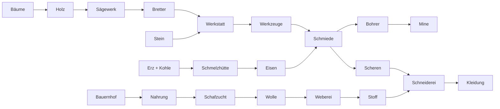
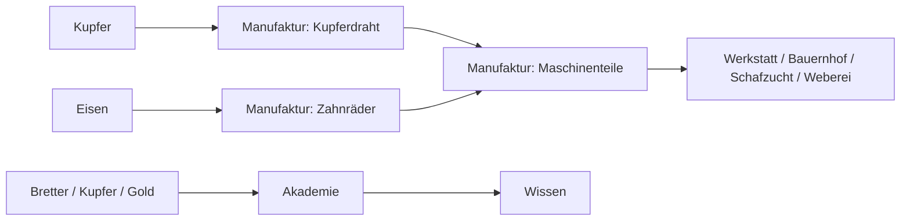

# Astra Civilisation — Gesamtspezifikation

**Dokumentversion:** 1.0 · **Stand:** 22. September 2026  
**Bezugsstand des Spiels:** Git-Commit `040e3ca` · npm-Paketversion `0.3.0`  
**Sprache:** Deutsch · **Plattform:** Desktop-Browser · **Modus:** Einzelspieler

## 1. Zweck, Geltung und Lesart

Diese Spezifikation beschreibt den aktuellen, über den ursprünglichen MVP hinausgewachsenen Stand von Astra Civilisation. Sie dient als gemeinsame Grundlage für Produktentscheidungen, Implementierung, Balancing, Fehlersuche und Abnahme. Sie wurde mit den Spielregeln im Quellcode abgeglichen; Gebäudekosten und Lagerkapazitäten wurden direkt aus den Definitionen extrahiert.

Die Spezifikation ersetzt die alten MVP- und Erweiterungsdokumente als Einstieg in die **aktuellen** Regeln. Historische Dokumente bleiben erhalten, beschreiben aber teilweise überholte Zustände: feste Flusskarte, sieben Startgebäude, Außenposten als erstes Endziel, unbegrenzte Lager oder andere Zivilisationsstufen.

**Lesart:** Die Kapitel 2–20 beschreiben implementiertes Verhalten und dessen fachliche Regeln. Kapitel 21 nennt überprüfbare Abnahmeszenarien. Kapitel 22 macht Grenzen und Abweichungen ausdrücklich sichtbar. Kapitel 23 enthält ausschließlich Vorschläge für spätere Arbeiten; diese sind weder umgesetzt noch durch dieses Dokument beauftragt. „Muss“ bezeichnet eine zu erhaltende Regel, keine Behauptung einer neuen Prüfung.

Dokumentversion, Paketversion und Speicherformat sind unabhängig. Dieses Dokument führt keine neue Spielversion und keine Änderung am Speicherformat ein.

### Inhaltsübersicht

1. [Zweck, Geltung und Lesart](#1-zweck-geltung-und-lesart)
2. [Produktidee und Spielprinzipien](#2-produktidee-und-spielprinzipien)
3. [Spielablauf und Zeitmodell](#3-spielablauf-und-zeitmodell)
4. [Welt, Seeds und Biome](#4-welt-seeds-und-biome)
5. [Expansion und Entfernungen](#5-expansion-und-entfernungen)
6. [Zivilisationsentwicklung](#6-zivilisationsentwicklung)
7. [Ressourcen und Warenmodell](#7-ressourcen-und-warenmodell)
8. [Gebäude, Bauen und Abriss](#8-gebäude-bauen-und-abriss)
9. [Bevölkerung und Arbeitsverteilung](#9-bevölkerung-und-arbeitsverteilung)
10. [Lokale Logistik und Händler](#10-lokale-logistik-und-händler)
11. [Produktion und Ausrüstung](#11-produktion-und-ausrüstung)
12. [Lagerkapazitäten und Reservierungen](#12-lagerkapazitäten-und-reservierungen)
13. [Wälder und bevorzugter Abbau](#13-wälder-und-bevorzugter-abbau)
14. [Stein und Tagebau](#14-stein-und-tagebau)
15. [Untertage und Bergbau](#15-untertage-und-bergbau)
16. [Wirtschaftsdashboard](#16-wirtschaftsdashboard)
17. [Oberfläche und Bedienung](#17-oberfläche-und-bedienung)
18. [Kamera, Sichtkreis und Gestaltung](#18-kamera-sichtkreis-und-gestaltung)
19. [Spielstände und Migration](#19-spielstände-und-migration)
20. [Technische Architektur und Qualitätsanforderungen](#20-technische-architektur-und-qualitätsanforderungen)
21. [Abnahmeszenarien](#21-abnahmeszenarien)
22. [Bekannte Grenzen und bewusste Vereinfachungen](#22-bekannte-grenzen-und-bewusste-vereinfachungen)
23. [Vorschläge für die weitere Entwicklung](#23-vorschläge-für-die-weitere-entwicklung)
24. [Quellen und Änderungsregeln](#24-quellen-und-änderungsregeln)

## 2. Produktidee und Spielprinzipien

Astra Civilisation ist eine ruhige Aufbausimulation: Aus einem kleinen Gründungslager entstehen mehrere Orte mit Produktionsketten, lokalen Arbeitskräften und überregionalem Warentransport. Die wirtschaftliche Inspiration sind Aufbauspiele wie „Die Siedler“; die plastische Blocklandschaft erinnert an die Voxelästhetik von Minecraft. Gebäude, Figuren, Icons und Gestaltung sind eigenständig.

Der Spieler führt keine Figur direkt. Er entscheidet über Bauplätze, Infrastruktur, Erkundung, Produktionsauswahl, Prioritäten und Abbauaufträge. Bewohner setzen diese Entscheidungen selbstständig um. Das Beobachten verständlicher Abläufe ist Teil des Spiels: Waren sollen in Lagern liegen, getragen werden, verarbeitet werden und an ihrem Ziel ankommen.

### 2.1 Produktprinzipien

| ID | Prinzip | Konsequenz |
|---|---|---|
| P-01 | Autonome Ausführung | Der Spieler gibt Ziele vor; Arbeiter finden Aufgaben und Wege selbst. |
| P-02 | Sichtbare Warenwirtschaft | Normale Lieferungen benötigen Personen, Wege, Ware und freien Zielplatz. |
| P-03 | Verständliche Engpässe | Fehlendes Personal, Zutaten, Aufträge, Wege und Lagerplatz werden unterscheidbar angezeigt. |
| P-04 | Wachstum durch Entscheidungen | Neue Regionen und Stufen erweitern Möglichkeiten und Lieferketten. |
| P-05 | Korrigierbare Bauplanung | Baustellenabbruch und Gebäudeabriss ermöglichen Umplanung. |
| P-06 | Kontinuierliche Landschaft | Regionsgrenzen dürfen die Erzeugung von Bergen, Gewässern und Adern nicht neu starten. |
| P-07 | Ruhige Präsentation | Zurückhaltende UI, verständliche Gebäudeformen, optionale Bewohnerlabels. |
| P-08 | Lokale Eigenständigkeit | Kein Konto, Backend oder laufender externer Assetabruf im Spiel erforderlich. |

Es gibt derzeit keinen Kampf, Hunger, Tod, Gegnerdruck oder Wettlauf. Ein Ressourcenengpass beendet die Partie nicht automatisch. Stufe 5 ist der höchste Entwicklungsstand; danach bleibt freies Bauen und Erkunden möglich.

## 3. Spielablauf und Zeitmodell

### 3.1 Ausgangslage einer neuen Partie

- Eine entdeckte Startregion mit **26 × 24 = 624 Feldern**, Regionskoordinate `0 / 0`.
- Ein fertiges Gründungslager auf Feld `8 / 12` und zehn Bewohner.
- Startbestand: **18 Holz, 4 Bretter, 12 Stein**, alle anderen Rohstoffe null.
- Stufe 1, Pionierlager; Spielzeit null, Anzeige „Tag 1“.
- Kleine freie Startfläche, garantierte nahe Bäume und Steinvorkommen sowie ein kurzes Startwegstück.
- Noch keine Untertagezellen im Spielzustand; der erste Mineneingang erschließt die Ebenen.

Ein neuer Seed ändert die Landschaft, nicht diese Grundausstattung. Beispielkoordinaten aus Anleitungen sind Einstiegshilfen, keine dauerhaft reservierten Bauplätze.

### 3.2 Hauptschleife

1. Einen erreichbaren Standort untersuchen.
2. Holz-, Stein- und Bretterproduktion aufbauen.
3. Wohnraum und Lager ergänzen, Personal und Lieferwege kontrollieren.
4. Engpässe im Gebäudeinspektor und im Wirtschaftsfenster beheben.
5. Eine benachbarte Region erkunden und bei Bedarf Brücken bauen.
6. Neue Orte mit Außenposten, Wohnraum und Händlerlogistik erschließen.
7. Bergbau, Metallverarbeitung und Textilien aufbauen.
8. Aufstiegsbedingungen erfüllen und Vorräte bezahlen.
9. In der Manufakturstufe Kupfer und Eisen weiterverarbeiten und bestehende Betriebe verbessern.

Der erste fertige Außenposten schließt weiterhin ein Einführungskapitel ab. Das interne Feld `won` markiert dieses Kapitel, **nicht** das Ende der gesamten Partie oder das Erreichen der Manufaktur.

### 3.3 Zeit und Geschwindigkeit

- Simulation in festen Schritten von **0,1 Spielsekunden**.
- Geschwindigkeiten: Pause, 1×, 2× und 4×.
- Ein angezeigter Tag entspricht **120 Spielsekunden**; der Tag ist derzeit eine Anzeige und kein Tageszeitenmodell mit wirtschaftlichen Effekten.
- Oberflächen-Arbeitstimer erhalten je Stufe nach dem Pionierlager 10 Prozent mehr Arbeitsgeschwindigkeit: Faktoren 1,0 / 1,1 / 1,2 / 1,3 / 1,4. Untertage-Abbau verwendet dieselben Stufenfaktoren.
- Lieferwege, Wartezeit und Materialmangel kommen zur reinen Arbeitszeit hinzu.
- Gewöhnliche Dialoge pausieren das Spiel und stellen danach das vorherige Tempo wieder her. Das Wirtschaftsfenster lässt die Simulation weiterlaufen.
- Bei ausgeblendetem Browsertab wird die Simulation nicht fortgeführt. Es gibt kein Nachholen von Offline-Fortschritt.
- Die Framezeit wird auf 0,1 Echtzeitsekunden begrenzt. Bei starker technischer Überlastung ist 1× deshalb keine garantierte Echtzeitrate.

## 4. Welt, Seeds und Biome

### 4.1 Koordinaten und Regionen

Die Spielwelt besteht aus einem ganzzahligen Feldraster mit den Achsen `x` und `z`. Negative Koordinaten sind erlaubt. Jede Region umfasst 26 Felder in x-Richtung und 24 in z-Richtung. Die Region eines Feldes wird durch Abrunden der entsprechenden Division bestimmt, auch bei negativen Koordinaten.

Regionen sind Einheiten für Erzeugung, Freischaltung und Speicherung. **Eine Region ist kein einzelnes Biom:** innerhalb derselben Region können Wald, Wiese, Hochland und Gewässer liegen. Der Name einer Region wird aus einer repräsentativen Probe ihres Inneren abgeleitet.

### 4.2 Seed-Regeln

- Neue Welten erhalten standardmäßig einen zufälligen 32-Bit-Seed.
- Zahlen und Texte sind als Eingabe erlaubt. Nichtnegative Zahlen werden auf den 32-Bit-Bereich abgebildet; Texte werden deterministisch gehasht.
- Gleicher Seed und gleiche Generatorversion erzeugen an denselben Weltkoordinaten dieselbe Ausgangslandschaft.
- Die Reihenfolge der Expeditionen darf das erzeugte Ergebnis an einer Koordinate nicht ändern.
- Ein Seed beschreibt die Ausgangslage. Gefällte Bäume, Bauten, Abbau und andere Veränderungen gehören zum gespeicherten Spielzustand.
- Gleicher Seed ist keine Garantie für identische Landschaften über zukünftige Änderungen am Generator hinweg.

### 4.3 Landschaftserzeugung

Zusammenhängende Rauschfelder bestimmen Höhen, Feuchtigkeit und Wärme. Flüsse und Seen werden vor der Biomzuordnung in globalen Koordinaten ermittelt. Hauptflüsse mäandern; lokale Verbreiterungen bilden Seen, quer verlaufende Nebenflüsse ergänzen das System. Täler senken die Geländeform an Gewässern ab.

Die Höhen werden in sichtbare Stufen quantisiert. Eine geglättete Startlichtung um das Gründungslager erleichtert den Einstieg. Gelände, Gewässer und Erzadern werden an einer Chunkgrenze nicht separat neu angesetzt. Am Rand der **noch nicht erkundeten** Welt kann die sichtbare Darstellung dagegen enden; die Fortsetzung wird erst durch eine Expedition erzeugt.

Die Landschaftshöhe beeinflusst derzeit die Darstellung. Es gibt keine zusätzliche Steigungsgrenze für Fußwege und keine separat zu bauenden Treppen an Bergen.

### 4.4 Biome und ihre Wirkung

| Biom | Charakter | Jungbaumreife ohne Försterei | Holz pro nachgewachsenem Baum | Dichteschwelle im Nahbereich |
|---|---|---:|---:|---:|
| Wiesenland | Fruchtbare Flächen, schnelle Bauernhöfe | 600 s / 10 min | 14 | 5 |
| Nadelwald | Dichte, dunklere Vegetation | 480 s / 8 min | 24 | 10 |
| Hochland | Höhere, felsige, teils verschneite Flächen | 720 s / 12 min | 12 | 3 |
| Sonnensteppe | Trockene Böden und wenige Bäume | 900 s / 15 min | 8 | 1 |

Die Dichteschwellen gelten für die Wiederbewaldung innerhalb einer Manhattan-Distanz von drei Feldern. Sie sind keine prozentualen Waldanteile. Junge und ausgewachsene Bäume zählen mit.

Anfangs erzeugte Bäume enthalten im Nadelwald 24 Holz, in den übrigen Biomen 20 Holz. Nachgewachsene Bäume verwenden dagegen die Werte der Tabelle. Anfangs erzeugte Steinvorkommen enthalten 100 Stein. Diese Unterscheidung ist aktuelles Balancing und darf nicht versehentlich als einheitlicher Baumwert dokumentiert werden.

## 5. Expansion und Entfernungen

### 5.1 Expeditionen

**EXP-01:** Eine Expedition erschließt sofort eine einzelne, bislang unentdeckte Region, die eine Kante mit einer bereits entdeckten Region teilt. Rein diagonale Nachbarschaft genügt nicht.

**EXP-02:** Die erste Expedition ist bereits im Pionierlager möglich. Sie benötigt keinen Außenposten und keinen vorherigen Kapitelabschluss.

**EXP-03:** Außenposten werden freigeschaltet, sobald mehr als eine Region entdeckt ist. Die Freischaltung gilt in Bauliste, Tastenkürzel und Platzierungsprüfung.

**EXP-04:** Die Expedition kostet Vorräte aus verfügbaren, nicht bereits reservierten Beständen. Es wird keine physisch laufende Expeditionsgruppe simuliert.

Für eine Zielregion `cx / cz` gelten:

```text
Entfernung d = |cx| + |cz|
Benötigte Stufe t = min(4, max(1, ceil(d / 2)))
Bretter = 16 + 4 × d
Stein   =  8 + 3 × d
Nahrung =  4 × d, falls t > 1; sonst 0
Werkzeuge = d, falls t > 2; sonst 0
```

Beispiel: Die erste seitlich angrenzende Region kostet **20 Bretter und 11 Stein**. Alternativ können **2 Diamanten** die regulären Expeditionskosten ersetzen. Nachbarschaft und erforderliche Stufe gelten dabei weiter.

### 5.2 Sortierung der Expeditionsliste

Entdeckte Regionen und neue Expeditionsziele werden in Koordinatenringen um die Startregion sortiert:

```text
Sortierring = max(|cx|, |cz|)
```

Zuerst Ring 0, danach alle Regionen in ±1, dann ±2 und so weiter. Bei Gleichstand folgen z- und x-Koordinate. Diese Sortierung verwendet bewusst eine andere Entfernung als die Kostenberechnung.

### 5.3 Begriffe für Reichweiten

| Zweck | Entfernung | Regel |
|---|---|---|
| Sichtkreis | Euklidisch: √(dx² + dz²) | 30 Felder Kern, 3 zusätzliche Randfelder |
| Lokaler Bewegungsbereich | Chebyshev: max(|dx|, |dz|) | Höchstens 9 je Richtung um den Heimatort |
| Holzfäller / Steinbruch | Manhattan: |dx| + |dz| | Vorkommen höchstens 9 vom Betrieb entfernt |
| Baubereich außerhalb der Startregion | Manhattan | Höchstens 9 von fertigem Außenposten oder Gründungslager |
| Försterei | Manhattan | Wirkung bis 7 Felder |
| Bevorzugte Mine eines Bergmannshauses | Manhattan | Haus–Mine bis 12 Felder; Erreichbarkeit bleibt erforderlich |
| Automatische Untertage-Erkundung | Manhattan | Bis 18 vom Schacht |
| Außenposten–Gründungslager | Manhattan | Mindestens 5 Felder |

Eine nahe Mine oder ein sichtbares Vorkommen ist damit nicht automatisch für jeden Bewohner erreichbar. Zusätzlich gelten Hindernisse, Ortszuordnung und die tatsächliche Wegsuche.

## 6. Zivilisationsentwicklung

### 6.1 Feste Stufenfolge

| Stufe | Name | Grenze normaler Bewohner | Neue Schwerpunkte | Arbeitsfaktor |
|---|---|---:|---|---:|
| 1 | Pionierlager | 20 | Holz, Stein, Bretter, Wohnen, Lager, Brücken, Expeditionen | 1,0 |
| 2 | Dorf | 32 | Landwirtschaft, Försterei, Werkstatt, Minen, Bergmannshäuser, Schmelzhütte, Schmiede | 1,1 |
| 3 | Viehzucht | 48 | Schafzucht, Weberei, Schneiderei, Pferdekarren | 1,2 |
| 4 | Kleinstadt | 96 | Rathaus, Akademie, Kutschen | 1,3 |
| 5 | Manufaktur | 128 | Industrielle Weiterverarbeitung und Maschinenteile | 1,4 |

Jedes fertige Lagerhaus ergänzt vier Händlerplätze **zusätzlich** zur normalen Bevölkerungsgrenze. Beispiel: Stufe Viehzucht mit acht Lagern erlaubt 48 normale Bewohner plus 32 Händler, also 80 Personen. Die tatsächlich verfügbare normale Wohnkapazität kann niedriger sein.

### 6.2 Voraussetzungen und Zahlungen

Alle genannten Gebäude müssen fertiggestellt sein; Aufstiegsbedingungen prüfen nicht zwingend, ob sie gerade produzieren. Die Bewohnerzahl der Aufstiegsprüfung umfasst aktuell auch Händler. Bedingungen und Zahlung sind getrennt: Ein vorhandenes Gebäude wird nicht beim Aufstieg verbraucht, Vorräte werden bezahlt.

| Aufstieg | Voraussetzungen | Einmalige Kosten |
|---|---|---|
| Pionierlager → Dorf | Je 1 Holzfäller, Sägewerk, Steinbruch, Wohnhaus, Lagerhaus; 14 Bewohner | 20 Bretter, 10 Stein |
| Dorf → Viehzucht | Je 1 Bauernhof, Mineneingang, Schmelzhütte; 18 Bewohner | 25 Bretter, 20 Stein, 20 Nahrung |
| Viehzucht → Kleinstadt | Je 1 Schafzucht, Weberei, Schneiderei; 2 Lagerhäuser; 3 entdeckte Regionen; 24 Bewohner | 40 Bretter, 30 Stein, 30 Nahrung, 4 Werkzeuge, 10 Kleidung |
| Kleinstadt → Manufaktur | Je 1 Rathaus, Werkstatt, Akademie, Schafzucht, Weberei, Schneiderei, Schmiede; 40 Bewohner | 40 Bretter, 30 Stein, 60 Nahrung, 20 Werkzeuge, 40 Wissen, 30 Kleidung, 10 Kupfer, 10 Eisen |

Der Aufstieg erfolgt durch eine ausdrückliche Aktion im Entwicklungsfenster. Er wird abgelehnt, wenn eine Voraussetzung fehlt oder die unreservierten Vorräte nicht ausreichen. Es gibt keine sechste Stufe; das Manufakturgebäude ist eine Freischaltung von Stufe 5 und keine Voraussetzung, um Stufe 5 zu erreichen.

## 7. Ressourcen und Warenmodell

### 7.1 Vollständiger Rohstoffkatalog

| Gruppe | Ressourcen |
|---|---|
| Grundlagen | Holz, Bretter, Stein, Nahrung |
| Handwerk und Forschung | Werkzeuge, Wissen |
| Untertage-Rohstoffe | Kohle, Kupfererz, Eisenerz, Golderz, Diamanten |
| Metallbarren | Kupfer, Eisen, Gold |
| Ausrüstung | Scheren, Bohrer |
| Textilien | Wolle, Stoff, Kleidung |
| Manufakturprodukte | Kupferdraht, Zahnräder, Maschinenteile |

Insgesamt bestehen **22 Ressourcentypen**. Erz und Barren sind unterschiedliche Ressourcen. Braunkohle aus Tagebau wird im gemeinsamen Kohlebestand geführt. Einfache Werkzeuge sind von Scheren und Bohrern getrennt.

### 7.2 Aufenthaltsorte und Bilanz

Eine Ware kann im Gebäudelager, als bereits geliefertes Baustellenmaterial, in der Hand eines Bewohners oder in der Rückgabemenge liegen. Reservierungen beschreiben Ansprüche auf vorhandene Ware oder auf Zielkapazität; sie erzeugen keine zusätzliche Ware.

**ECO-01:** Normale Lieferungen entfernen Ware erst bei Abholung aus der Quelle und legen sie nach Ankunft am Ziel ab.

**ECO-02:** Bestände dürfen nicht durch doppelte Reservierungen negativ werden. Ein- und Ausgänge dürfen nicht durch parallel eintreffende Lieferungen überfüllt werden.

**ECO-03:** Die globale Bestandsanzeige summiert Gebäudeinventare. Getragene Güter, Baustellenmaterial und Rückgaben werden nicht unbemerkt in diesen Wert eingerechnet.

**ECO-04:** Expeditionen und Aufstiege bezahlen aus global verfügbaren Gebäudevorräten. Rückgaben werden administrativ wieder verteilt. Diese Vorgänge sind Ausnahmen vom sichtbaren Transport durch Figuren.

Es gibt keine Geldwährung, Marktpreise, Käufer oder Verkäufe. Wissen verhält sich technisch wie eine lagerbare Ware. Nahrung wird für Rezepte, Bauten und Entwicklung verwendet, nicht als laufender persönlicher Hungerbedarf.

## 8. Gebäude, Bauen und Abriss

### 8.1 Vollständiger Gebäudekatalog

Alle Kosten sind Stückzahlen. „Personal“ bezeichnet dauerhaft zugeordnete Arbeitsplätze; Wohnplätze sind davon unabhängig. Grundstücke bestehen regeltechnisch aus einem Feld, auch wenn ein Modell darüber hinausragt.

| Gebäude | Ab Stufe | Baukosten | Personal / Zweck |
|---|---|---|---|
| Gründungslager | 1 | Kostenlos | 10 Wohnplätze, Lager, Heimatort; höchstens eines |
| Holzfäller | 1 | 4 Holz, 2 Stein | 1 Arbeitsplatz; Holzgewinnung |
| Sägewerk | 1 | 5 Holz, 3 Stein | 1 Arbeitsplatz; Bretter |
| Steinbruch | 1 | 4 Holz, 2 Bretter | 1 Arbeitsplatz; Stein und Tagebau |
| Wohnhaus | 1 | 3 Holz, 4 Bretter, 2 Stein | 2 normale Wohnplätze |
| Bergmannshaus | 2 | 6 Holz, 10 Bretter, 8 Stein | 4 normale Wohnplätze mit Minenpräferenz |
| Lagerhaus | 1 | 4 Holz, 4 Bretter, 3 Stein | 4 eigene Händlerplätze und Lager |
| Brücke | 1 | 4 Bretter, 2 Stein | Ein begehbares Wasserfeld nach Fertigstellung |
| Bauernhof | 2 | 6 Holz, 8 Bretter, 4 Stein | 1 Arbeitsplatz; Nahrung |
| Försterei | 2 | 6 Holz, 10 Bretter, 4 Stein | Passiver Wachstumseffekt; kein Arbeitsplatz |
| Werkstatt | 2 | 8 Holz, 16 Bretter, 20 Stein, 10 Nahrung | 1 Arbeitsplatz; einfache Werkzeuge |
| Akademie | 4 | 8 Holz, 24 Bretter, 24 Stein, 12 Nahrung | 1 Arbeitsplatz; Wissen |
| Rathaus | 4 | 12 Holz, 30 Bretter, 40 Stein, 20 Nahrung, 8 Werkzeuge | Heimatort und Lager; kein Arbeitsplatz und keine Wohnplätze |
| Mineneingang | 2 | 6 Holz, 8 Bretter, 6 Stein | 1–4 Arbeitsplätze; Standard 1 |
| Schmelzhütte | 2 | 6 Holz, 12 Bretter, 14 Stein | 1 Arbeitsplatz; Metallbarren |
| Schmiede | 2 | 6 Holz, 14 Bretter, 12 Stein | 1 Arbeitsplatz; Scheren oder Bohrer |
| Schafzucht | 3 | 8 Holz, 12 Bretter, 6 Stein, 6 Nahrung | 1 Arbeitsplatz; Wolle |
| Weberei | 3 | 8 Holz, 18 Bretter, 10 Stein, 4 Nahrung | 1 Arbeitsplatz; Stoff |
| Schneiderei | 3 | 8 Holz, 20 Bretter, 12 Stein, 8 Nahrung, 4 Werkzeuge | 1 Arbeitsplatz; Kleidung |
| Manufaktur | 5 | 12 Holz, 30 Bretter, 30 Stein, 20 Nahrung, 8 Werkzeuge, 4 Kupfer, 4 Eisen | 1 Arbeitsplatz; Draht, Zahnräder, Maschinenteile |
| Außenposten | 1 + erste Expedition | 6 Holz, 12 Bretter, 10 Stein | Heimatort, Lager und Baubereich; keine eigenen Bewohner |

**Weg:** kostenlos, sofort angelegt, kein Gebäudeinventar und kein Arbeitsplatz. Er entfernt einen Jungbaum auf dem Feld und erhöht die gewöhnliche Laufgeschwindigkeit von 1,5 auf 2,4 Felder pro Spielsekunde.

### 8.2 Platzierung

Ein Bauplatz muss entdeckt, erreichbar und frei von Gebäuden, ausgewachsenen Bäumen und Steinvorkommen sein. Junge Bäume blockieren nicht und werden beim Planen entfernt. Wasser erlaubt ausschließlich Brücken. Eine begonnene oder beauftragte Tagebauschicht muss vor dem Bauen abgeschlossen werden.

In der Startregion besteht keine zusätzliche Außenposten-Baugrenze. Außerhalb benötigen gewöhnliche Gebäude einen fertigen Außenposten oder ein fertiges Gründungslager innerhalb der in Kapitel 5 beschriebenen Bauentfernung. Außenposten, Gründungslager und Wege sind von dieser zusätzlichen Grenze ausgenommen; Brücken besitzen eine eigene Uferregel.

Ein Außenposten benötigt nach Freischaltung mindestens fünf Manhattan-Felder Abstand vom vorhandenen Gründungslager. Es gibt keine allgemeine Mindestdistanz zwischen zwei Außenposten. Ein Rathaus ist ein Heimat- und Lagerort, erweitert im derzeitigen Platzierungscode aber **nicht** selbst die Baugrenze einer neuen Region.

### 8.3 Baustellen

Baustellen dürfen vor vollständiger Finanzierung geplant werden. Jede Baustelle hält angelieferte Materialien getrennt vom Betriebsinventar. Träger und Händler liefern tatsächlich an; fehlende Materialien erscheinen im Inspektor.

Sobald alles geliefert ist, läuft der Aufbau automatisch: gewöhnliche Gebäude benötigen 8 Spielsekunden, Brückenfelder 12. Dieser Baufortschritt belegt keinen eigenen Bauarbeiter. Die Stufenboni der Produktionsarbeit beschleunigen diese Aufbauzeit nicht.

Die Gründungsreserve schützt bis zum ersten fertigen Holzfäller dessen Kosten von vier Holz und zwei Stein vor gewöhnlichen konkurrierenden Lieferungen. Sie ist eine Einstiegshilfe, keine Garantie gegen jede denkbare Fehlplanung oder jede globale Zahlung.

### 8.4 Brücken

Jedes Wasserfeld benötigt ein eigenes Brückengebäude für vier Bretter und zwei Stein. Die nächste Baustelle muss von einem erreichbaren Ufer oder einer fertigen Brücke aus zugänglich sein. Erst nach Fertigstellung ist das Wasserfeld begehbar. Eine lange Querung besteht aus mehreren einzelnen Bau- und Lieferprozessen.

### 8.5 Abbruch und Abriss

| Aktion | Materialbehandlung | Folgen |
|---|---|---|
| Unfertige Baustelle abbrechen | Bereits Geliefertes und getragene Lieferungen werden zurückgeführt | Feld wird wieder verfügbar |
| Fertiges Gebäude abreißen | Lagerinventar und mitgeführte Güter bleiben erhalten | Arbeitsplätze und Gebäudefunktion entfallen |
| Fehlender Platz für Rückgabe | Güter warten in `returns` | Im Dashboard sichtbar; Verteilung bei freiem Lagerplatz |

Fertige Gebäude verlangen eine Bestätigung. Alle Gebäudetypen sind abreißbar, auch Gründungslager, Brücke und Mine. Baukosten, bereits verbrauchte Produktionszutaten und angebrochene Ausrüstungsnutzungen werden nicht erstattet.

Bewohner werden bei Wohnraumverlust nicht gelöscht. Neue normale Bewohner ziehen erst wieder bei freien Plätzen unterhalb der Grenze ein. Händler eines abgerissenen Lagers warten ohne Lagerheimat auf einen neuen Standort; bei Neubau werden sie wieder eingesetzt.

Minenabriss holt Bergleute und Ladungen an die Oberfläche; offene Höhlen bleiben erhalten. Brückenabriss versetzt betroffene Bewohner auf ein sicheres Feld und plant Wege neu. Der Abriss eines Außenpostens entfernt dessen Baubereich, nicht die Erkundung. Ein fehlendes Gründungslager kann kostenlos neu gebaut werden; höchstens eines darf gleichzeitig bestehen.

## 9. Bevölkerung und Arbeitsverteilung

### 9.1 Wohnraum und Zugehörigkeit

Das Gründungslager stellt zehn, ein Wohnhaus zwei und ein Bergmannshaus vier normale Wohnplätze bereit. Fertige Lagerhäuser beherbergen jeweils vier Händler. Außenposten und Rathaus erzeugen selbst keine Bewohner.

Bei Fertigstellung geeigneter Wohngebäude und beim Stufenaufstieg werden freie Plätze bis zur geltenden Grenze gefüllt. Es gibt keine Schwangerschaft, Alterung oder Einwanderungsreise aus einer Außenwelt. Neue Bewohner erscheinen am zugewiesenen Wohnort.

Jeder normale Bewohner besitzt eine Wohnzuordnung und einen Heimatort, normalerweise Gründungslager, Außenposten oder Rathaus. Ein Wohngebäude orientiert sich am nächstgelegenen Heimatort. Der Ortswechsel vorhandener Bewohner ist begrenzt und darf laufende Aufträge nicht einfach abbrechen.

### 9.2 Arbeitsplatzvergabe

- Ein Arbeitsplatz je produzierendem Betrieb; Minen besitzen eine einstellbare Sollbesetzung von 1–4.
- Nur fertige, aktive Betriebe werden neu besetzt.
- Händler erhalten keine Produktionsstellen.
- Mindestens **zwei normale Bewohner insgesamt** bleiben ohne Produktionsstelle als allgemeine Träger reserviert. Das bedeutet nicht zwei garantierte Träger in jedem Ort.
- Betriebsprioritäten: Niedrig, Normal, Hoch.
- Bei gleicher Priorität wird zuerst eine Stelle je Betrieb besetzt, danach zusätzliche Minenstellen.
- Hohe Priorität darf geeignete Arbeiter eines niedrigeren Betriebs nach Abschluss ihrer laufenden Aufgabe übernehmen.
- Vorhandene Waren, eine hohe Gesamtbevölkerung oder ein freier Platz im Betrieb garantieren keine Zuteilung: Ein geeigneter, örtlich erreichbarer Bewohner muss verfügbar sein.
- Ein belegter Betrieb verliert sein Personal nicht allein deshalb, weil sein Ausgangslager voll ist.

Bergmannshausbewohner erhalten bei neuen Minenzuteilungen eine Präferenz für Minen in zwölf Manhattan-Feldern Hausentfernung. Das umgeht weder den lokalen Oberflächenbereich noch die Wegprüfung und entlässt keine bereits arbeitende Mannschaft nur wegen eines neuen Hauses.

### 9.3 Zustandsmodell eines Arbeiters

Ein normaler Bewohner kann ohne Auftrag, als Träger, an einem Produktionsauftrag oder auf einer Bergbaufahrt sein. Oberflächenaufträge unterscheiden Abholung, Arbeit und Ablieferung. Die Trennung von **Arbeitsplatz** und **aktueller Aufgabe** erklärt, warum ein zugeteilter Arbeiter zeitweise unterwegs ist.

Bei Pausierung, Personalabbau oder Prioritätswechsel beendet ein Arbeiter laufende Aufgaben beziehungsweise Ladungen, bevor seine Stelle freigegeben wird. Gebäudeabriss ist eine eigene Ausnahme mit geregelter Warenrückgabe.

## 10. Lokale Logistik und Händler

### 10.1 Gewöhnliche Bewohner

Normale Oberflächenwege müssen vollständig innerhalb von neun Feldern je Richtung um den Heimatort liegen. Nicht nur das Ziel, sondern jeder Wegpunkt wird geprüft. Vierseitige Wegsuche benutzt entdecktes Land und fertige Brücken. Ausgewachsene Bäume und Steinvorkommen blockieren; Gebäude sind grundsätzlich zugängliche Betriebsflächen.

Normale Bewohner transportieren höchstens zwei Waren pro Lieferung. Bei unterschiedlichen Ortszuordnungen dürfen sie auch dann keinen ortsübergreifenden Transport übernehmen, wenn die beiden lokalen Bereiche überlappen. Die Spezialbewegung eines Bergmanns unter Tage folgt dem Stollennetz statt der normalen Oberflächen-Wegprüfung.

### 10.2 Händleraufgaben

Jedes fertige Lagerhaus besitzt genau vier zugehörige Händlerplätze. Händler sind an ihr Heimatlager gebunden, können aber auf dem zusammenhängenden entdeckten Wegenetz andere Orte erreichen.

Aufgabenreihenfolge für die überörtliche Versorgung:

1. Offene Baustellen mit Material versorgen.
2. Aktive Betriebe mit Zutaten und Ausrüstung versorgen.
3. Lagerbestände unterschiedlicher Orte ausgleichen.
4. Bei Bedarf weitere passende Trägeraufgaben übernehmen.

Beim Ausgleich werden Unterschiede zwischen Quellen und Zielen, Reservierungen und freie Kapazität berücksichtigt. Exportreihenfolge und Rohstoffwechsel verhindern, dass immer derselbe Betrieb oder dieselbe Ware bevorzugt wird. Es gibt keine manuell anlegbaren Handelsrouten und keine Liste externer Handelspartner.

### 10.3 Fahrzeuge

| Entwicklungsstand | Verfügbar je Lagerhaus | Maximale Ladung je Fahrt |
|---|---|---:|
| Pionierlager / Dorf | Zu Fuß | 2 |
| Viehzucht | 1 Pferdekarren | 8 mit Karren, sonst 2 |
| Kleinstadt / Manufaktur | 1 Pferdekarren und 1 Kutsche | 16 mit Kutsche, 8 mit Karren, sonst 2 |

Fahrzeuge werden mit der Stufe automatisch freigeschaltet. Sie benötigen keine eigene Produktion, Ställe, Kaufkosten oder Futter. Die Übernahme erfolgt am Heimatlager; wenn beide frei sind, wird die Kutsche bevorzugt. Das Fahrzeug bleibt bis zur Rückkehr reserviert. Ein Lager kann maximal eine Kutsche und eine Karre gleichzeitig einsetzen. Andere Händler laufen zu Fuß.

Fahrzeuge erhöhen die Oberflächenbewegung um den Faktor 1,3. Der Wegebonus gilt zusätzlich. Eine größere Fahrzeugkapazität bedeutet nicht automatisch eine volle Ladung: tatsächlicher Bedarf, Quellbestand und Zielplatz begrenzen den Auftrag.

### 10.4 Aufbau eines neuen Ortes

Ein empfohlenes Muster ist: Lagerhaus im bestehenden Ort fertigstellen, Expedition bezahlen, Zugang öffnen, Außenposten planen, örtliche Wohnhäuser ergänzen, Betriebe bauen und einen weiteren Lagerstandort einrichten. Händler ermöglichen Materiallieferungen, bevor die neue Siedlung eigene normale Arbeiter besitzt.

## 11. Produktion und Ausrüstung

### 11.1 Rezepte

Alle Zeitangaben sind Basis-Arbeitszeiten pro Charge in Spielsekunden, ohne Transport und ohne Stufen- oder Ausrüstungsbonus. Zutatenmengen sind je Charge angegeben.

| Betrieb / Auswahl | Eingang | Ergebnis | Basiszeit |
|---|---|---|---:|
| Sägewerk | 1 Holz | 2 Bretter | 5 s |
| Werkstatt | 1 Stein + 1 Brett | 1 Werkzeug | 9 s |
| Bauernhof im Wiesenland | Keine Zutaten | 2 Nahrung | 9 s |
| Bauernhof im Nadelwald / Hochland | Keine Zutaten | 2 Nahrung | 14 s |
| Bauernhof in Sonnensteppe | Keine Zutaten | 2 Nahrung | 22 s |
| Schmelzhütte, Eisen | 1 Eisenerz + 1 Kohle | 1 Eisen | 10 s |
| Schmelzhütte, Kupfer | 1 Kupfererz + 1 Kohle | 1 Kupfer | 10 s |
| Schmelzhütte, Gold | 1 Golderz + 1 Kohle | 1 Gold | 10 s |
| Schmiede, Scheren | 1 Eisen + 1 Werkzeug | 1 Schere | 12 s |
| Schmiede, Bohrer | 1 Eisen + 1 Werkzeug | 1 Bohrer | 12 s |
| Schafzucht | 1 Nahrung | 2 Wolle | 12 s |
| Weberei | 1 Wolle | 1 Stoff | 10 s |
| Schneiderei | 1 Stoff + 1 Scherennutzung | 1 Kleidung | 10 s |
| Akademie, Bretter | 1 Brett | 2 Wissen | 12 s |
| Akademie, Kupfer | 1 Kupfer | 6 Wissen | 12 s |
| Akademie, Gold | 1 Gold | 20 Wissen | 12 s |
| Manufaktur, Draht | 1 Kupfer | 2 Kupferdraht | 12 s |
| Manufaktur, Zahnräder | 1 Eisen | 2 Zahnräder | 12 s |
| Manufaktur, Maschinenteile | 1 Kupferdraht + 1 Zahnrad | 1 Maschinenteil | 12 s |

Holzfäller benötigen vier und Steinbrucharbeiter fünf Basis-Arbeitssekunden pro Abbauauftrag, jeweils mit höchstens zwei Rohstoffen und zusätzlichen Laufwegen. Tagebau nutzt die Steinbrucharbeit. Untertage gelten die Tiefenzeiten in Kapitel 15.

### 11.2 Beginn und Ende einer Charge

Ein neuer Produktionsauftrag benötigt einen erreichbaren Arbeiter, alle Zutaten, gegebenenfalls Pflichtausrüstung und Platz für die gesamte Ausgabemenge einschließlich bestehender Reservierungen. Zutaten werden beim Anlegen des Arbeitsauftrags verbraucht und in der Wirtschaftsstatistik erfasst. Fehlende Zutaten kann der Arbeiter selbst holen; außerdem beliefern Händler und Träger die Betriebe nach ihren Regeln.

Die Ware entsteht bei Abschluss der Produktion. Ein Transport derselben Ware zählt später nicht erneut als Produktion. Mengen und Zutaten der bereits begonnenen Charge bleiben bei Rezeptwechseln erhalten.

### 11.3 Rezeptauswahl während der Arbeit

Schmelzhütte, Schmiede, Akademie und Manufaktur haben eine Auswahl im Inspektor. Standardwerte sind Eisen, Scheren, Bretter und Kupferdraht.

Die Auswahl darf während laufender Arbeit nicht gesperrt werden. Ein Wechsel wird bei beschäftigtem Arbeiter vorgemerkt und vor dem nächsten passenden Auftrag übernommen. Der Inspektor zeigt laufende und vorgemerkte Auswahl. Eine weitere Auswahl ersetzt den vorgemerkten Wechsel; Rückwahl des aktuellen Rezepts hebt ihn auf. Vormerkungen werden gespeichert und beim Laden validiert.

### 11.4 Ausrüstung

| Ausrüstung | Empfänger | Nutzungen pro Stück | Wirkung |
|---|---|---:|---|
| Schere | Schneiderei | 20 | Pflicht für Kleidung, eine Nutzung je Charge |
| Bohrer | Mine | 40 | 50 % höhere Arbeitsgeschwindigkeit beim Graben |
| Maschinenteil | Werkstatt, Bauernhof, Schafzucht, Weberei | 20 | 25 % höhere Arbeitsgeschwindigkeit |

Ein Stück wird beim erstmaligen Einsatz aus dem Inventar entnommen; Restnutzungen stehen am Gebäude. Ein Bohrer ist keine Voraussetzung für Bergbau. Maschinenteile sind ebenfalls optional. Der Verbrauch in der Statistik zählt das aktivierte Ausrüstungsstück, nicht jede Nutzung als ganzes Stück.

Die Arbeitszeit eines unterstützten Auftrags folgt:

```text
Arbeitszeit = Basiszeit / Stufenfaktor / Ausrüstungsfaktor
```

Beispiel: Eine Werkstatt auf Stufe 5 mit Maschinenteil benötigt rechnerisch `9 / 1,4 / 1,25 ≈ 5,14` Arbeitssekunden pro Werkzeug, zusätzlich zu Liefer- und Wartezeiten. Diskrete Simulationsschritte können die effektive Zeit leicht erhöhen.

### 11.5 Produktionsketten





## 12. Lagerkapazitäten und Reservierungen

### 12.1 Kapazitätsmodell

Kapazitäten gelten **pro Rohstoff**, nicht als gemeinsame Gesamtzahl über alle Güter. Gründungslager, Lagerhaus, Außenposten und Rathaus fassen je 100 Einheiten **jedes** Ressourcentyps. Ein Lager mit 100 Stein kann deshalb noch 100 Holz aufnehmen.

Für alle nicht aufgeführten Rohstoffe eines Betriebs gilt Kapazität null. Unfertige Gebäude haben kein Betriebsinventar; Baustofflieferungen werden separat gegen den Bauplan gerechnet.

| Gebäudetyp | Kapazitäten je einzelnem Rohstoff |
|---|---|
| Holzfäller | 20 je Holz |
| Sägewerk | 10 je Holz; 20 je Bretter |
| Steinbruch | 20 je Stein, Kohle |
| Wohnhaus | Kein Warenlager |
| Bergmannshaus | Kein Warenlager |
| Lagerhaus | 100 je Holz, Bretter, Stein, Nahrung, Werkzeuge, Wissen, Kohle, Kupfererz, Eisenerz, Golderz, Diamanten, Kupfer, Eisen, Gold, Scheren, Bohrer, Wolle, Stoff, Kleidung, Kupferdraht, Zahnräder, Maschinenteile |
| Brücke | Kein Warenlager |
| Bauernhof | 20 je Nahrung; 2 je Maschinenteile |
| Försterei | Kein Warenlager |
| Werkstatt | 10 je Bretter, Stein; 20 je Werkzeuge; 2 je Maschinenteile |
| Akademie | 10 je Bretter, Kupfer, Gold; 20 je Wissen |
| Mineneingang | 40 je Stein, Kohle, Kupfererz, Eisenerz, Golderz, Diamanten; 2 je Bohrer |
| Schmelzhütte | 10 je Kohle, Kupfererz, Eisenerz, Golderz; 20 je Kupfer, Eisen, Gold |
| Schmiede | 10 je Werkzeuge, Eisen; 20 je Scheren, Bohrer |
| Schafzucht | 10 je Nahrung; 20 je Wolle; 2 je Maschinenteile |
| Weberei | 10 je Wolle; 20 je Stoff; 2 je Maschinenteile |
| Schneiderei | 2 je Scheren; 10 je Stoff; 20 je Kleidung |
| Manufaktur | 10 je Kupfer, Eisen; 20 je Kupferdraht, Zahnräder, Maschinenteile |

Kupferdraht und Zahnräder sind in der Manufaktur sowohl Eingang als auch Ausgang und haben deshalb jeweils 20 Plätze. Ausrüstungspuffer sind getrennt von bereits aktivierten Restnutzungen.

### 12.2 Reservierung und Vollzustand

Die nutzbare Restkapazität lautet:

```text
Freier Platz = max(0, Kapazität − aktueller Bestand − erwartete Eingänge)
```

Erwartete Eingänge umfassen auch bereits zugeteilte Fördermengen und ganze Produktionschargen. Die Kapazitätsprüfung darf nicht erst beim Ablegen stattfinden. Bei vollem Ausgang wird kein neuer Auftrag für diesen Ausgang begonnen. Andere Lager mit Platz können Waren aufnehmen; Personal und Wege bleiben zusätzlich erforderlich.

Ein volles Minenlager für Kupfer verhindert weitere Kupferaufträge ohne Platz. Die Auftragsauswahl prüft Fördergüter einzeln; sie ist nicht grundsätzlich für jedes andere Material gesperrt, nur weil eine Warenart voll ist. Eine zusammenfassende Statusmeldung kann dennoch auf den vollen Teilbestand hinweisen.

### 12.3 Rückgaben

Abbruch und Abriss dürfen vorhandene Güter nicht wegen fehlender Kapazität löschen. Überschüssige Rückgaben stehen außerhalb der normalen Lager in einer gesonderten Menge und werden bei freiem Platz verteilt. Das ist eine Wiederherstellungsregel, keine normale Produktionslagerung und keine beliebige manuelle Vorratserweiterung.

Die ausdrücklich genehmigte Kürzung alter Bestände beim Wirtschaftsformatwechsel ist eine einmalige Migration und keine laufende Löschregel für heutige Überschüsse.

## 13. Wälder und bevorzugter Abbau

### 13.1 Wachstum

Alle 20 Spielsekunden wird die Ökologie aktualisiert. Pro entdeckter Region können dabei bis zu zwei neue Jungbäume gesetzt werden, sofern freie, sichere und ausreichend dünn bewaldete Standorte vorliegen.

Ein Baum hat fünf sichtbare Jungbaumstufen und danach den ausgewachsenen Zustand. Junge Bäume bleiben begehbar und bebaubar. Erst ein ausgewachsener Baum ist ein Hindernis und ein Holzvorkommen. Beim Bebauen wird ein Jungbaum entfernt.

Wasser, Wege, Tagebaufelder, Gebäude und deren unmittelbare Zugänge sowie benutzte Bewohner- und Auftragsfelder werden geschützt. Vor der endgültigen Reife wird zusätzlich die Erreichbarkeit kontrolliert. Kann ein Baum einen Zugang abschneiden, wird seine Reife zurückgehalten. Die Tabellenzeiten sind deshalb Mindestzeiten bei ungestörtem Wachstum, keine garantierten Termine.

Eine aktive fertige Försterei verdoppelt den Wachstumsschritt von 20 auf 40 Sekunden innerhalb von sieben Manhattan-Feldern und erlaubt drei zusätzliche Bäume in der lokalen Dichteprüfung. Sie ist ein passives Gebäude ohne Arbeiterstelle.

### 13.2 Bevorzugtes Fällen

Ablauf: Baum auswählen → „Bevorzugt fällen“. Die goldene Markierung bleibt erhalten, bis das Vorkommen erschöpft oder der Auftrag aufgehoben wird. Markierungen werden gespeichert.

Markierte Bäume werden vor unmarkierten Vorkommen gewählt. Die Priorität vergrößert weder die Betriebsreichweite noch den örtlichen Bewegungsbereich. Laufende Aufträge werden nicht sofort unterbrochen. Der Holzfäller braucht einen begehbaren Nachbarplatz am Baum und Platz für die Ladung im Hüttenlager.

Ein Baum verschwindet erst, wenn seine gesamte Holzmenge abgetragen ist. Mehrere Abbau- und Rücktransportzyklen sind daher normal. Der Inspektor soll bei Verzögerung Personal, Reichweite, Weg und Lagerplatz nachvollziehbar machen.

## 14. Stein und Tagebau

### 14.1 Endliche Oberflächenvorkommen

Ein natürliches Steinvorkommen wird in einzelnen Ladungen abgebaut. Bei Restmenge null wird das Feld frei. Der Steinbruch selbst verschwindet nicht, sondern benötigt ein weiteres Vorkommen oder einen Tagebauauftrag. „Bevorzugt abbauen“ verwendet dieselbe Prioritätsidee wie das Fällen eines markierten Baums.

### 14.2 Tagebauauftrag

Ein entdecktes freies Landfeld kann ausgewählt und zum Tagebau beauftragt werden. Gebäude, Wege, Wasser, ausgewachsene Bäume und noch vorhandene Steinblöcke müssen vorher berücksichtigt beziehungsweise freigemacht werden. Ein Jungbaum wird entfernt.

Jeder Auftrag baut **eine Schicht mit 20 Rohstoffen** ab. Nach Abschluss wird die nächste Ebene nicht automatisch beauftragt. Aufträge können pausiert und fortgesetzt werden; eine laufende Abbauladung wird beendet. Die sichtbare Geländehöhe sinkt nach einer abgeschlossenen Ebene um 0,8 Darstellungs-Welteinheiten.

### 14.3 Terrassenregel

Maximal drei Ebenen unter der ursprünglichen Oberfläche:

- Ebene 1 benötigt keine bereits abgesenkten Nachbarfelder.
- Für Ebene 2 müssen alle acht Nachbarfelder mindestens Ebene 1 erreicht haben.
- Für Ebene 3 müssen alle acht Nachbarfelder mindestens Ebene 2 erreicht haben.
- Nicht erkundete oder nicht entsprechend abgesenkte Nachbarn erfüllen die Bedingung nicht.

Die zweite Ebene in der Mitte erfordert damit eine 3×3-Vorbereitung, die dritte eine gestaffelte 5×5-Fläche. Die Regel vergleicht abgeschlossene Abbauebenen relativ zur ursprünglichen Oberfläche, nicht die natürliche absolute Berghöhe.

### 14.4 Ertrag

| Schicht | Ertrag pro Feldschicht | Chance auf Braunkohle statt Stein |
|---|---:|---:|
| 1 | 20 | 0 % |
| 2 | 20 | 5 % |
| 3 | 20 | 10 % |

Die Auswahl ist seed- und koordinatenabhängig und bleibt nach Laden gleich. Die Prozentwerte sind Generatorwahrscheinlichkeiten und garantieren nicht exakt entsprechende Anzahlen in kleinen Stichproben. Braunkohle wird als Kohle gelagert und kann in der Schmelzhütte genutzt werden.

Oberflächentagebau erzeugt keine Verbindung zu einer Untertagehöhle. Es sind getrennte Spielsysteme.

## 15. Untertage und Bergbau

### 15.1 Zugang und Ebenen

Ab Stufe Dorf wird ein Mineneingang auf einem gültigen Oberflächenbauplatz errichtet. Mit Fertigstellung öffnet sein Schacht alle drei diskreten Ebenen:

| Ebene | Anzeige | Mögliche Erze | Basisarbeit je Abbauladung |
|---|---|---|---:|
| 1 | −12 m | Kohle, Kupfererz, Eisenerz | 6 s |
| 2 | −32 m | Zusätzlich Golderz | 8 s |
| 3 | −64 m | Zusätzlich Diamanten | 10 s |

Die Meterwerte sind eine taktische Darstellung, kein frei grabbarer kontinuierlicher Höhenraum. Es werden keine vertikalen Treppen oder Aufzüge durch Arbeiter gebaut. Der Schacht stellt die Verbindung bereit. Eine Tiefenauswahl betrifft neue Aufträge; eine laufende Fahrt bleibt auf ihrer begonnenen Ebene.

### 15.2 Höhlen und Adern

Höhlen und Erzadern entstehen deterministisch aus globalen Koordinaten. Geschlossener gewöhnlicher Fels enthält zwei Stein; Erzfelder enthalten je nach Seed **6, 8, 10, 12 oder 14** Einheiten einer Erzart. Offene Höhlen enthalten kein abbaubares Material.

Unbekannte Felder werden dunkel dargestellt. Beim Öffnen eines Schachts oder vollständigem Entfernen eines Blocks werden die zusammenhängende offene Höhle und angrenzende Felsfronten sichtbar. Ein Erz wird nicht durch bloßes Sichtbarwerden in das Lager übertragen.

### 15.3 Manuelle und automatische Aufträge

- Einzelnes Feld über „Stollen graben“ markieren.
- Rechteck über zwei Ecken markieren, maximal 256 Felder pro Aktion.
- Optional Koordinaten im Inspektor eingeben.
- Eigene Markierungen wieder freigeben.
- Automatische Erkundung je Mine ein- oder ausschalten; Standard eingeschaltet.

Eine manuelle Markierung gehört zu einer Mine und einer Ebene. Ein bereits einer anderen Mine zugeordnetes Feld wird nicht einfach übernommen. Manuelle Aufträge können weiter als 18 Felder entfernt liegen, brauchen aber eine erreichbare Front. Automatik berücksichtigt unzugeordnete sichtbare Felsfronten bis 18 Manhattan-Felder vom Schacht.

Auswahlreihenfolge: eigene manuelle Aufträge, dann bekannte Erzfelder vor gewöhnlichem Fels, danach Entfernung. Die Automatik hat keine gesonderte Dropdown-Auswahl „nur Kupfer“. Für gezielten Kupferabbau markiert der Spieler eine sichtbare Kupferader und schafft einen verbundenen Stollen dorthin; bei Bedarf wird die Automatik abgeschaltet.

### 15.4 Fahrt eines Bergmanns

1. Einen freien, erreichbaren Abbauplatz reservieren.
2. Auf der Oberfläche zum eigenen Schacht laufen.
3. Auf die gewählte Ebene wechseln und durch offene, bekannte Stollen zu einem Nachbarfeld des Blocks laufen.
4. Mit Spitzhacke beziehungsweise Bohrer arbeiten.
5. Höchstens zwei Rohstoffe aufnehmen.
6. Zum Schacht zurücklaufen und ins Minenlager ablegen.
7. An die Oberfläche zurückkehren und den nächsten Auftrag bestimmen.

Ein Block bleibt geschlossen, solange noch Inhalt vorhanden ist. Neue Höhlen werden erst nach dem letzten Abtrag dieses Blocks zugänglich. Untertagebewegung beträgt 1,6 Felder je Spielsekunde; der Oberflächenanmarsch eines Bergmanns verwendet im aktuellen Spezialablauf 1,5.

### 15.5 Mannschaften und Wartegründe

Eine Mine beginnt mit einem Sollarbeitsplatz und kann auf bis zu vier eingestellt werden. Neue Stellen benötigen normale Bewohner, örtlichen Zugang und genügend Personal neben der Trägerreserve. Mehrere Bergleute reservieren unterschiedliche Zielblöcke; ein gemeinsamer einzelner erreichbarer Block erlaubt keine beliebige Parallelisierung.

Mögliche Wartegründe: kein Personal, laufende Oberflächenlieferung, Mine pausiert, keine Markierung bei ausgeschalteter Automatik, nicht verbundene Front, bereits reserviertes Ziel oder kein Lagerplatz für das jeweilige Fördergut.

Der Mineninspektor und die Untertage-Betriebsanzeige zeigen Ist-/Sollbesetzung, Aktivitäten, Ladungen und die aktuelle Ebene. „Bergmann auswählen“ wählt eine Person; „Bergmann zeigen“ fordert die Kamera auf, ihren Aufenthaltsort zu zeigen, innerhalb der geltenden Fokusgrenzen.

## 16. Wirtschaftsdashboard

### 16.1 Daten und Zeitfenster

Das Wirtschaftsfenster zeigt alle 22 Ressourcen, auch solche mit Bestand oder Aktivität null. Es aktualisiert sich während laufender Simulation.

| Wert | Bedeutung |
|---|---|
| Bestand / Kapazität | Summiertes Gebäudeinventar und summierte Kapazitäten |
| Unterwegs | Tatsächlich getragene Güter |
| Rückgaben | Noch nicht wieder eingelagerte administrative Rückgaben |
| Freier Platz | Kapazität nach Beständen und erwarteten Eingängen |
| Gewinnung / Produktion | Neu erzeugte Menge pro Spielminute |
| Verbrauch | Tatsächlich verbrauchte Menge pro Spielminute |
| Saldo | Produktion minus Verbrauch |
| Betriebsbedarf | Fehlende Baustoffe und Material für nächste Aufträge |
| Aufstiegsbedarf | Kosten des nächsten Aufstiegs |
| Optionale Ausrüstung | Fehlende Bohrer oder Maschinenteile separat |

Gemessen wird in Zehnsekunden-Intervallen über die letzten fünf Spielminuten. Bei kürzerer Historie wird nur die tatsächlich beobachtete Zeit verwendet, mit einem Mindestnenner von einer Sekunde. Werte sind ein gleitender Rückblick, keine Vorhersage und keine theoretische Maximalkapazität.

### 16.2 Buchungsregeln

- Rohstoffgewinnung bei erfolgreichem Abbau.
- Produktionsausgang bei Fertigstellung der Charge.
- Produktionszutaten beim Beginn des Auftrags.
- Baumaterial bei Fertigstellung des Gebäudes.
- Aufstiegs- und Expeditionskosten bei Zahlung.
- Aktivierte Ausrüstung als ein verbrauchtes Stück.
- Normale Transporte sind weder Produktion noch Verbrauch.

### 16.3 Einordnung in verbindlicher Reihenfolge

1. **„-“**, wenn im Messfenster sowohl Produktion als auch Verbrauch null sind.
2. **„Bedarf ungedeckt“**, wenn Betriebs- plus Aufstiegsbedarf größer als Bestand plus unterwegs ist.
3. **„Lager voll“**, wenn der Bestand die positive Gesamtkapazität erreicht.
4. **„Vorrat sinkt“**, wenn der Saldo kleiner als −0,01 pro Minute ist.
5. **„Überschuss“**, wenn der Saldo größer als +0,01 pro Minute ist.
6. **„Ausgeglichen“** für verbleibende Fälle mit tatsächlicher Aktivität.

Die Nullregel hat Vorrang auch dann, wenn ein Rohstoff für einen zukünftigen Auftrag fehlt. Der konkrete Bedarf bleibt in seinen eigenen Spalten sichtbar. Das Dashboard behauptet bei völliger Inaktivität nicht „Ausgeglichen“.

### 16.4 Personal und Betriebe

Die Übersicht trennt Bewohner, Händler, örtliche Träger, belegte Arbeitsplätze, Gesamtstellen und freie Stellen. Ein Betriebsverzeichnis zeigt Zustände und Engpässe. Gesamtzahlen ersetzen keine örtliche Diagnose: Ein leerer Steinbruch kann trotz hoher Bevölkerung an einer fehlenden lokal verfügbaren Arbeitskraft liegen.

## 17. Oberfläche und Bedienung

### 17.1 Hauptbereiche

- **Kopfzeile:** Hauptvorräte, Bewohner, Tag, Pause und Geschwindigkeit.
- **Funktionsleiste:** Entwicklung, Expeditionen, Seed/Neue Welt, Oberfläche/Unter Tage, Wirtschaft, Spielstände, Bewohnerlabels.
- **Geschichts-/Entwicklungskarte:** Einführung, aktuelle Anforderungen, nächster Aufstieg.
- **Inspektor:** Gebäude, Rohstofffeld oder freier Bauplatz; Bestand, Kapazität, Personal, Produktionsauswahl, Priorität und Aktionen.
- **Bauleiste:** Kategorien Pioniere, Dorf & Stadt, Bergbau, Viehzucht & Handwerk; Freischaltungen und Kosten.
- **Minikarte:** Gesamtheit der entdeckten Regionen beziehungsweise Untertageübersicht; Klick zum Fokussieren.
- **Kamerawerkzeuge:** Rotation, Zoom, Heimatansicht.
- **Statusbereich:** Ereignisse und Speichermeldungen.

### 17.2 Eingaben

| Aktion | Eingabe |
|---|---|
| Auswählen / bauen / markieren | Kurzer Linksklick |
| Fokus verschieben | Linke Maustaste gedrückt ziehen, WASD, Pfeiltasten |
| Kamera drehen | Rechtsziehen, Q / E |
| Alternative Kamerabewegung | Shift + Rechtsziehen |
| Zoom | Mausrad oder Plus-/Minus-Schaltflächen |
| Heimatansicht | H oder Kompass |
| Bauwerk auswählen | 1–8 im aktuellen Baureiter |
| Pause / fortsetzen | Leertaste oder Pause-Schaltfläche |
| Geschwindigkeit | 1× / 2× / 4× |
| Bauplan / Markierung abbrechen | Escape |

Ein Ziehen darf beim Loslassen keinen Bau- oder Auswahlklick auslösen. Eine Bewegung ab sechs Bildschirmpixeln gilt als Drag, auch wenn die Maus danach zum Ausgangspunkt zurückkehrt. Abgebrochene Mausgesten und Fokusverlust setzen den Gestenzustand zurück.

### 17.3 Bewohnerlabels und Animation

Bewohnerlabels sind standardmäßig für Oberfläche und Untertage ausgeschaltet. Beide Einstellungen sind getrennt und gelten browserweit für normale Partien; Sandbox-Einstellungen liegen separat. Labels außerhalb des voll sichtbaren Kerns werden verborgen.

Holzfäller führen Axtschläge aus; Steinbrucharbeiter und Bergleute verwenden Spitzhacken. Splitter, Armbewegungen und Ausrichtung zeigen aktive Arbeit. Laufbewegung, Ladung, Helme, Karrenräder und Pferdebeine vermitteln die jeweilige Aufgabe. Arbeitsanimationen verwenden Spielzeit und halten bei Pause an.

### 17.4 Rückmeldungen und Schutz vor Fehlbedienung

Ungültige Platzierungen, fehlende Vorräte, gesperrte Gebäude, unzugängliche Fronten und Speicherfehler brauchen eine konkrete Meldung. Bestätigungen werden für Abriss und endgültiges Löschen verwendet. Ein Rezeptwechsel benötigt keine Bestätigung und bleibt während der Arbeit bedienbar.

Aktionsschaltflächen und zentrale Controls besitzen zugängliche Namen und sichtbare Fokuszustände. Eine vollständige Bedienung des 3D-Rasters ohne Maus oder eine vollständig barrierefreie Spielwelt ist noch nicht umgesetzt.

## 18. Kamera, Sichtkreis und Gestaltung

### 18.1 Ansicht

Die Kamera ist orthografisch, drehbar, verschiebbar und zoombar. Es gibt keine First-Person-Perspektive. Gelände und Gebäude bestehen aus blockartigen Modellen mit gestuften Höhen, klaren Silhouetten und zurückhaltenden Farben. Schmelzhütte und Schmiede müssen visuell unterscheidbar bleiben: gemauerter hoher Ofen gegenüber offener Werkstätte mit Amboss.

### 18.2 Sichtbereich

**VIS-01:** Im Regelfall bleiben 30 Felder Radius vollständig sichtbar. Dazu kommen **drei weitere Spielfelder**, die weich auslaufen: äußerer Radius 33.

**VIS-02:** Die drei Felder werden in Weltkoordinaten gemessen. Sie sind keine drei Bildschirmpixel und wachsen beim Heranzoomen mit.

**VIS-03:** Der Fokus wird innerhalb der tatsächlichen entdeckten Fläche begrenzt, einschließlich konkaver Ränder und fehlender Regionen. Der volle Kern soll nicht in unentdeckte Leere ragen.

**VIS-04:** Passt der 30er-Kern nirgends vollständig hinein, wird der größte passende Kern verwendet. In einer einzelnen Startregion beträgt er beim ganzzahligen Fokus 11,5 Felder. Die drei Zusatzfelder werden trotzdem addiert.

**VIS-05:** Kamera- und Zielposition werden gemeinsam korrigiert, damit Winkel und Zoom erhalten bleiben. Neue Regionen aktualisieren die zulässigen Fokuspositionen.

Das beschränkt bewusst die Kamerabewegung an Rändern. Schmale Ausläufer und äußerste Ecken sind dadurch nicht immer vollständig ins Zentrum zu bringen. Der zusätzliche Saum darf über den entdeckten Rand reichen; dort werden keine fiktiven spielbaren Felder erzeugt.

### 18.3 Randdarstellung

Der zusätzliche Streifen geht mit einer glatten Interpolation in dieselbe Hintergrundfarbe über, die außerhalb der Welt sichtbar ist. Der Effekt greift auf beleuchtete Oberflächen zu; die 30 Kernfelder werden nicht reduziert oder ausgeblendet.

Flächen bleiben blickdicht mit aktiver Tiefenprüfung. Einzelne Voxelwände werden nicht halbtransparent übereinander gezeichnet, weil dies Gittermuster, dunkle Ringe und sichtbare Innenflächen erzeugt. Es gibt keinen separaten leuchtenden Ring. Oberfläche und Untertage verwenden passende helle beziehungsweise dunkle Hintergrundfarben.

Vorhandene Felder im zusätzlichen Saum sind auswählbar und können bei gültiger Platzierung bebaut werden. Ein kleiner technischer Geometriepuffer berücksichtigt ganze Randfelder und überhängende Modelle; der Shader begrenzt deren sichtbaren Teil.

### 18.4 Darstellung und Simulation trennen

Außerhalb des sichtbaren Ausschnitts laufen Produktion, Transport, Erkundungszustand und Wachstum weiter. Bewohner außerhalb der darzustellenden Umgebung werden nicht animiert. Die Minikarte zeigt weiterhin die gesamte entdeckte Welt.

Der Sichtkreis reduziert Renderarbeit, **nicht** die Größe des Spielzustands. Ganze entdeckte Regionen verbleiben im Speicher. Es gibt noch kein Streaming oder Auslagern ferner Simulationsteile.

## 19. Spielstände und Migration

### 19.1 Mehrere Partien

Die Spielstandsbibliothek verwaltet eigenständige benannte Welten mit ID, Name, Seed, Speicherzeitpunkt, Tag, Stufe, Bewohner- und Regionszahl. Namen werden auf 60 Zeichen begrenzt. Die Liste ist nach letzter Speicherung absteigend sortiert.

| Aktion | Verbindliches Verhalten |
|---|---|
| Neue Welt | Neue Partie mit zufälligem oder eingegebenem Seed |
| Neu starten | Neue zusätzliche Partie mit demselben Seed; alter Fortschritt bleibt erhalten |
| Laden | Aktuelle Partie vorher speichern, danach Zielwelt aktivieren |
| Umbenennen | Metadaten ändern, Weltzustand erhalten |
| Löschen | Bestätigung; aktive Partie kann nicht direkt gelöscht werden |
| Neustart der Anwendung | Zuletzt aktive lesbare Partie fortsetzen |

### 19.2 Automatisches Speichern

Speicherversuche erfolgen alle 20 Echtzeitsekunden außerhalb modaler Dialoge, beim Verlassen beziehungsweise Verbergen der Seite, manuell sowie bei wichtigen bestätigten Aktionen. Vor einem geplanten Weltwechsel muss das Speichern gelingen; bei Fehler wird der Wechsel abgebrochen.

Daten und Metadaten werden zusammen in IndexedDB geschrieben. Automatisches Speichern beim Schließen ist ein Browserereignis und keine Garantie gegen abrupten Prozessabbruch, Stromausfall oder erzwungenes Beenden. Ein bereits erfolgreich abgeschlossener Speichervorgang ist die belastbare Sicherung.

### 19.3 Speicherort und Format

- IndexedDB-Datenbank `astra-civilisation`, Datenbankversion 1, Object Store `saves`.
- Getrennte Schlüsselräume `worlds:normal:` und `worlds:sandbox:`.
- Spielformat `version: 3`, Wirtschaftsrevision 2, Logistikrevision 1.
- Lokales Browserprofil und Origin begrenzen den Datenzugriff; `localhost:5173` und `127.0.0.1:5173` sind unterschiedliche Origins.
- Kein Benutzerkonto, Cloud-Sync, serverseitiger Spielstand oder geräteübergreifender Abgleich.

Gespeichert werden unter anderem erzeugte und veränderte Felder, Regionen, Gebäude, Inventare, Baustellen, Bewohner, Heimatzuordnungen, aktuelle Ladungen und Aufträge, Untertagezellen, Markierungen, Rezeptvormerkungen, Ausrüstungsnutzungen, Fortschritt, Wirtschaftshistorie und Rückgaben. Kameraausrichtung und temporäre UI-Auswahl gehören nicht zum fachlichen Weltzustand. Bewohnerlabel-Einstellungen werden separat in localStorage gespeichert.

### 19.4 Übernahme älterer Daten

Ein vorhandener einzelner v3-Spielstand unter `astra-civilisation:save:v3` wird bei Bedarf in die Bibliothek übernommen, ohne die Quelldaten zu löschen. Alte Testformate v1 und v2 werden nicht als aktuelle Partien geladen.

Ältere v3-Wirtschaftsdaten werden auf die neue Stufenfolge, Ressourcen und Kapazitäten normalisiert. Frühere Überschüsse werden entsprechend der bestätigten Projektentscheidung einmalig entfernt. Angefangene alte Lieferungen werden neu geplant; getragene Güter werden soweit vorgesehen in Rückgaben gesichert. Die Logistikmigration ergänzt Heimatorte und Händler. Bestehende Minen ohne Sollwert verwenden einen Arbeitsplatz.

### 19.5 Validierung und Fehler

Beim Laden werden Format, endliche Zahlen, nichtnegative Warenmengen, Feldkoordinaten, Gebäude- und Personenreferenzen, zulässige Rezepte, Fahrzeugbesetzung und Untertagezustände überprüft. Beschädigte Daten dürfen nicht unbemerkt durch automatisches Speichern ersetzt werden.

Der Deserialisierer weist derzeit JSON-Zeichenketten mit mehr als **30.000.000 Zeichen** zurück. Das ist ein konkretes technisches Leselimit und kein garantierter Speicherplatz pro Welt. Die Schreibfunktion führt nicht dieselbe Größenprüfung vorab aus; sehr große Partien können deshalb trotz vorheriger Speicherung später nicht mehr ladbar sein. Siehe Kapitel 22 und Verbesserungsvorschläge.

## 20. Technische Architektur und Qualitätsanforderungen

### 20.1 Laufzeit

TypeScript-Anwendung mit Vite und Three.js im Browser. Node.js wird für Entwicklung, Build und Tests benötigt, nicht als Spielserver. Aktuell sind Three.js `0.186.0`, Vite `8.3.0` und TypeScript `7.0.2` im Paketmanifest verzeichnet.

```sh
npm install
npm run dev -- --port 5173
npm test
npm run build
```

Der Entwicklungsserver ist unter `http://127.0.0.1:5173` vorgesehen. Geometrie, Icons und Schriften werden lokal ausgeliefert; verwendet werden DM Sans und Manrope. Das öffentliche Git-Repository ist keine automatische Aussage über eine veröffentlichte Spielwebsite.

### 20.2 Modulverantwortung

| Modul | Verantwortung |
|---|---|
| `src/sim.ts` | Fachlicher Spielzustand, Definitionen, Bau, Produktion, Prioritäten, Fortschritt, Serialisierung |
| `src/generator.ts` | Seed-Verarbeitung, globale Landschaftsfelder und Regionen |
| `src/surface.ts` | Jungbaumstufen, Tagebauregeln, Oberflächenabsenkung |
| `src/mining.ts` | Untertagefelder, Höhlen, Aufträge, Bergbaufahrten |
| `src/logistics.ts` | Heimatorte, lokale Wege, Händlerrollen und Fahrzeuge |
| `src/economy.ts` | Kapazitäten, Reservierungen, Ausrüstung, Flussmessung und Dashboardwerte |
| `src/world.ts` | Three.js-Szene, Kamera, Instanzen, Modelle, Picking, Animation |
| `src/visibility.ts` | Sichtkreise und zulässiger Kamerafokus |
| `src/visibility-light.ts` | Blickdichter Nebelübergang im Zusatzradius |
| `src/main.ts` | UI, Dialoge, Eingaben, Spielschleife und Speicheraktionen |
| `src/persistence.ts` | IndexedDB-Zugriff und ältere Einzelspielstände |
| `src/save-library.ts` | Partien, Metadaten, Wechsel, Umbenennen, Löschen |

### 20.3 Zentrale Datenobjekte

| Objekt | Fachlich wichtige Felder |
|---|---|
| GameState | Seed, Zeit, Stufe, Regionen, Felder, Gebäude, Bewohner, Untertage, Ereignisse, Rückgaben, Revisionen |
| Tile | Koordinate, Region, Biom, Höhe, Land/Wasser, Vorkommen, Restmenge, Weg, Jungbaum, Priorität, Tagebau |
| Building | Typ, ID, Koordinate, Fertigstellung, Materiallieferungen, Inventar, Aktivität, Priorität, Rezept, Ausrüstung |
| Villager | ID, Name, Position, Wohnort, Heimatort, Rolle, Arbeitsplatz, Aufgabe, Ladung, Tiefe |
| Task | Typ, Phase, Quelle, Ziel, Rohstoff, Menge, Weg, Timer, gegebenenfalls Fahrzeug |
| UndergroundTile | Position, Ebene, geschlossen/offen, sichtbar/unbekannt, Erz, Menge, Minenauftrag |
| MiningTrip | Mine, Ebene, Ziel, Phase, Weg und Arbeitstimer |
| SavedWorld | Partien-ID, Name, Seed, Aktualisierung, Tag, Stufe, Bevölkerung, Regionen |

### 20.4 Qualitätsziele

| ID | Anforderung | Nachweis / Einschränkung |
|---|---|---|
| Q-01 | Seed-Erzeugung bleibt reproduzierbar | Generator- und Erweiterungstests |
| Q-02 | Keine doppelte Ware durch Reservierungen | Wirtschaft-, Logistik- und Abbruchtests |
| Q-03 | Ausgeblendete Felder simulieren weiter | Trennung von Simulation und Rendering |
| Q-04 | Laufende Aufträge bleiben beim Speichern konsistent | Speicher- und Rezeptwechseltests |
| Q-05 | Keine sichtbaren Shaderfehler oder transparenten Randgitter | Browserprüfung beider Ansichtsebenen |
| Q-06 | Normale Partien bleiben von Testfixtures getrennt | Eigener Sandbox-Schlüsselraum |
| Q-07 | Größere Welten zeichnen nur einen begrenzten Ausschnitt | Sichtkreis, instanziertes Gelände, ausgeblendete Figuren |
| Q-08 | Performancebehauptungen benötigen Messdaten | Kein aktuell belegtes FPS-Ziel auf M5 Max oder anderer Hardware |

Die UI aktualisiert regulär etwa alle 0,25 Echtzeitsekunden; die Simulation arbeitet separat. Dekorative Voxel werden nach Material instanziert. Sichtbarkeitsgrenzen werden beim Erweitern neu berechnet und zwischengespeichert. Die Simulation und manche Such- oder Wachstumsoperationen betrachten trotzdem die ganze Welt.

### 20.5 Entwicklungs- und Testwelten

`npm run fixtures` erzeugt isolierte Szenarien für Einstieg, große Welt, Bergbau und Wirtschaft. Weitere spezialisierte Skripte erzeugen Oberflächen-, Arbeiter- und Handelsszenarien. Manche Fixtures stammen aus Simulationsdurchläufen, andere sind ausdrücklich mit Vorräten ausgestattete Vorschauen. Sie sind kein Nachweis, dass sämtliche Kosten im normalen Spiel bereits verdient wurden.

Die Entwicklungsszenarien werden über `?sandbox&scenario=…` verwendet, schreiben getrennte Spielstände und werden nicht als Fixtures im Produktionsbuild ausgeliefert. Automatische Tests laufen mit dem Node-Testframework; CI prüft Tests und Build.

## 21. Abnahmeszenarien

Die folgenden Szenarien beschreiben Erwartungen. Sie sind nicht alle als neue Tests durch die Erstellung dieses Dokuments ausgeführt worden. Für vorhandene Nachweise siehe [QA-Protokoll](QA.md). Der zuletzt dokumentierte vollständige Lauf am 21. September 2026 umfasst 110 erfolgreiche Tests.

| ID | Ausgangslage und Aktion | Erwartetes Ergebnis |
|---|---|---|
| A-01 | Zwei neue Welten mit gleichem Seed; Regionen in anderer Reihenfolge erkunden | Gleiche Ausgangsfelder an denselben Koordinaten |
| A-02 | Gewässer/Berg an einer Regionskante; angrenzende Expedition | Kontinuierliche Erzeugung, kein Neustart an der Grenze |
| A-03 | Pionierlager mit genügend Vorräten, noch kein Außenposten | Erste Expedition möglich; danach Außenposten frei |
| A-04 | Gemischte Ziele in ±1 und ±2 | Vollständiger Ring ±1 vor ±2 |
| A-05 | Baustelle ohne komplette Vorräte | Planung möglich, fehlende Materialien angezeigt, Bau erst nach Lieferung |
| A-06 | Mehrere gleichzeitige Transporte in fast volles Lager | Gesamte Reservierungen überschreiten die Rohstoffkapazität nicht |
| A-07 | Werkstatt mit 10 Stein, Lager mit 100 Stein | Weitere Steinlieferung wird am jeweiligen Ziel verhindert |
| A-08 | Zwei Orte mit überlappenden Bewegungsbereichen | Ortsübergreifende Lieferung durch Händler, nicht normale Bewohner |
| A-09 | Lager auf Stufe 4 mit vier beschäftigten Händlern | Höchstens eine Kutsche und eine Karre gleichzeitig zugeordnet |
| A-10 | Freie Produktionsstelle, nur zwei normale Träger übrig | Neue Stelle bleibt unbesetzt oder erhält einen zulässigen Umverteiler |
| A-11 | Hohe Priorität bei anderem noch beschäftigtem Arbeiter | Keine Unterbrechung der laufenden Ladung; spätere Umverteilung |
| A-12 | Aktive Eisenschmelze; Auswahl Kupfer | Laufende Eisencharge korrekt fertig; danach Kupfer; Vormerkung speicherbar |
| A-13 | Vollständige Woll-, Stoff- und Scherenversorgung | Schneiderei produziert Kleidung; eine Schere deckt 20 Zyklen |
| A-14 | Mine mit/ohne Bohrer | Beide können graben; Bohrer beschleunigt 40 Arbeitszyklen |
| A-15 | Markierter Baum und erreichbarer Holzfäller | Markierung erhält Vorrang; Feld erst nach vollständigem Abbau frei |
| A-16 | Jungbaum an gültigem Bauplatz | Bau möglich; Jungbaum entfernt; ausgewachsener Baum blockiert |
| A-17 | Erschöpfter natürlicher Stein; freier Tagebauplatz | Steinbruch kann einen gültigen Tagebauauftrag übernehmen |
| A-18 | Mittleres Feld soll Ebene 2 ohne vorbereitete Nachbarn erreichen | Auftrag abgelehnt; nach 3×3-Vorbereitung erlaubt |
| A-19 | Tagebau auf Ebene 3 abgeschlossen | Keine vierte Ebene möglich |
| A-20 | Ferne Untertagemarkierung ohne verbundenen Stollen | Kein Teleport; zuerst eine erreichbare Front schaffen |
| A-21 | Vier Bergleute und mehrere offene Arbeitsfronten | Unterschiedliche Ziele reserviert, Ladungen korrekt zurückgebracht |
| A-22 | Dashboard ohne Produktion und Verbrauch | Einordnung exakt „-“ |
| A-23 | Produktion läuft nur außerhalb des Kamerakreises | Wirtschaft und Lager verändern sich weiter |
| A-24 | Fokus über Weltkante oder Regionsloch verschieben | Voller Kern bleibt in der entdeckten Fläche; Winkel und Zoom erhalten |
| A-25 | Normale ausreichend große Welt, aktueller Sichtkreis | 30 Felder voller Kern plus drei auslaufende Felder, kein Gitterring |
| A-26 | Welt neu starten | Neue Partie mit gleichem Seed; bisheriger Fortschritt vorhanden |
| A-27 | Speicherfehler vor Weltwechsel | Wechsel abgebrochen, bisherige Daten nicht automatisch ersetzt |
| A-28 | Lager oder Mine mit Waren abreißen | Waren/Personen erhalten, Rückgaben gegebenenfalls sichtbar |
| A-29 | Brücke mit laufendem Transport abreißen | Bewohner gesichert, Wege neu geplant oder Ladung zurückgegeben |
| A-30 | Linke Maustaste ziehen und wieder zum Start bewegen | Keine versehentliche Bauaktion beim Loslassen |
| A-31 | Unbenutztes Browserprofil öffnen | Oberflächen- und Untertagelabels standardmäßig aus |
| A-32 | Bedingungen und Kosten aller vier Aufstiege erfüllen | Exakte Folge Pionierlager → Dorf → Viehzucht → Kleinstadt → Manufaktur |

## 22. Bekannte Grenzen und bewusste Vereinfachungen

Diese Punkte gehören zum aktuellen Stand und dürfen in Produktbeschreibungen nicht als bereits gelöst dargestellt werden:

1. **Weltgröße:** keine feste Zahl an Regionen, aber RAM, Rechenzeit, IndexedDB-Quota und das JSON-Leselimit begrenzen reale Partien. „Unendlich“ ist kein technisch belastbares Versprechen.
2. **Speichersicherheit sehr großer Welten:** Schreib- und Leselimit sind noch nicht symmetrisch geprüft. Ein Größenhinweis vor dem Speichern ist eine mögliche nächste Verbesserung.
3. **Kamera:** die vollständige Kernkreis-Abdeckung begrenzt die Erreichbarkeit äußerster Ecken und schmaler Landzungen im Fokus. Nicht jede entdeckte Position lässt sich zentrieren.
4. **Reichweiten:** Baubereich, Arbeitsplatzreichweite und persönlicher Bewegungsbereich verwenden unterschiedliche Metriken. Die UI visualisiert diese nicht überall als separate Overlays.
5. **Rathaus:** Heimatort und Lager, aber kein eigener Erweiterer der Baugrenze in neuen Regionen.
6. **Arbeitskräfte:** zwei allgemeine Träger global; keine Garantie für eine ausreichende Trägerzahl je Ort. Händler ersetzen keine Produktionsarbeiter.
7. **Bewohner und Tiere:** keine Alterung, Krankheit, Geburt oder Hungerwirtschaft; Schafzucht ist ein Produktionsbetrieb, kein individuell simuliertes Herdenmanagement.
8. **Fahrzeuge:** automatisch verfügbar und an Händleraufträge gebunden; keine Fahrzeugherstellung, Straßenklassen oder separaten Ställe.
9. **Transportausnahmen:** globale Zahlungen und Rückgaben sind administrative Vorgänge. Bergleute wechseln diskret am Schacht die Ebene.
10. **Gelände:** Höhen beeinflussen nicht die Begehbarkeit durch Steigung. Es gibt kein frei verformbares Blockvolumen und keine Wasserphysik.
11. **Försterei:** passiver Effekt ohne Arbeitsplatz; natürliche Reife kann zum Schutz von Zugängen länger dauern.
12. **Bergbau:** keine Erzsorten-Auswahl für die Automatik, keine Einstürze, Belüftung, Flutung, Stützen oder Aufzüge. Manuelle Aufträge und Höhlenzugang bestimmen den Vortrieb.
13. **Zeit:** keine Offline-Produktion, keine Jahreszeiten, kein spielmechanischer Tag-/Nachtzyklus.
14. **Bedienung:** Desktop mit Maus und Tastatur; vollständige Touch- und Screenreader-Bedienung der Spielwelt sind nicht zugesichert.
15. **Speicherbibliothek:** kein Cloud-Sync, keine zusammenführbaren gleichzeitigen Änderungen mehrerer Tabs und keine sichtbare Export-/Import-Verwaltung für Spielstanddateien.
16. **Endspiel:** Stufe 5 öffnet weitere Verarbeitung und freies Wachstum, aber noch keine sechste Stufe oder zusätzliche Kampagne.
17. **Performance:** Rendering wurde begrenzt; daraus folgt keine nachgewiesene konstante Framerate bei beliebig großer Welt. Das Produktionsbundle erzeugt derzeit einen Größenhinweis im Build.

Diese Einschränkungen sind keine implizite Freigabe, Regeln zu ändern. Größere Änderungen an Spielbalance, Weltzugang oder Speicherkompatibilität benötigen eine eigene aktualisierte Spezifikation.

## 23. Vorschläge für die weitere Entwicklung

Die nachstehenden Vorschläge sind eine priorisierte Diskussionsgrundlage, **kein beauftragter Implementierungsplan**.

| Priorität | Vorschlag | Nutzen | Vor Umsetzung zu entscheiden |
|---|---|---|---|
| Hoch | Symmetrische Speichergrößenprüfung und Export/Import | Große Testwelten vor nicht ladbaren Zuständen schützen | Umgang mit Grenzüberschreitung und Sicherungsformat |
| Hoch | Sichtbare Orts-, Bau- und Arbeitsreichweiten | Fehlende Arbeiter und unzugängliche Vorkommen verständlicher machen | Gemeinsames Overlay oder getrennte Ansichten |
| Hoch | Performanceprofil mit festen Weltgrößen | Engpässe in Simulation, Wegsuche und Rendering messbar trennen | Referenzhardware, Szenarien, Zielwerte |
| Mittel | Dynamischer Kamerarand für schmale Regionen | Alle entdeckten Orte bequem erreichen | Ob der Kern an Engstellen kleiner werden darf |
| Mittel | Kupfer-/Eisenfokus für Minenautomatik | Gezielte Produktionsketten erleichtern | Priorisierung oder strikter Ausschluss anderer Vorkommen |
| Mittel | Pro-Ort-Wirtschaftsübersicht | Lokalen Mangel trotz globalem Überschuss sichtbar machen | Ortsabgrenzung und Zuordnung transportierter Güter |
| Mittel | Erweiterte Manufakturziele | Längerfristige Aufgaben nach Stufe 5 | Neue Produkte, Bauwerke und Abschlussbedingungen |
| Später | Weitere Biome, Jahreszeiten oder Handelsaufträge | Abwechslung und zusätzliche Entscheidungen | Einfluss auf Saveformat und bestehende Seeds |

## 24. Quellen und Änderungsregeln

### 24.1 Maßgebliche Projektquellen

- [Spielkern und Gebäudedefinitionen](../src/sim.ts)
- [Wirtschaft und Kapazitäten](../src/economy.ts)
- [Heimatorte und Händler](../src/logistics.ts)
- [Weltgenerator](../src/generator.ts)
- [Oberfläche und Tagebau](../src/surface.ts)
- [Bergbau](../src/mining.ts)
- [Kamera und Darstellung](../src/world.ts)
- [Sichtbereich](../src/visibility.ts) und [Nebelrand](../src/visibility-light.ts)
- [Spieloberfläche](../src/main.ts)
- [Speicherbibliothek](../src/save-library.ts) und [Persistenz](../src/persistence.ts)
- [Release Notes](../RELEASE_NOTES.md) und [QA-Protokoll](QA.md)

### 24.2 Historische Dokumente

[MVP-Spezifikation](MVP-SPEC.md), [ursprünglicher Umsetzungsplan](IMPLEMENTATION-PLAN.md), [Expansion](EXPANSION-SPEC.md), [Welt und Bergbau](WORLD-MINING-PLAN.md), [Bergmannssiedlung](MINING-SETTLEMENT-PLAN.md), [Wirtschaft](ECONOMY-PLAN.md), [Oberfläche](SURFACE-PLAN.md) und [lokaler Handel](LOCAL_TRADE_PLAN.md) erklären frühere Entscheidungen. Bei abweichenden Zahlen beschreibt diese Gesamtspezifikation den genannten Bezugsstand.

### 24.3 Pflege dieser Spezifikation

Änderungen an Kosten, Rezepten, Kapazitäten, Reichweiten, Stufen oder Speicherverhalten sollen die entsprechende Tabelle, betroffene Abnahmeszenarien und Release Notes gemeinsam aktualisieren. Generatoränderungen müssen die Bedeutung von Seeds und mögliche Savefolgen benennen. Neue Funktionen werden erst nach Implementierung und Prüfung aus Kapitel 23 in die geltenden Regeln übernommen.

**Änderungshistorie:** Version 1.0 vom 22. September 2026 konsolidiert den Spielstand `040e3ca`, einschließlich lokaler Händler, fünf Entwicklungsstufen, Oberflächen- und Untertageabbau, mehreren Partien sowie 30 + 3 Feldern Sichtbereich mit blickdichtem Nebelrand.
